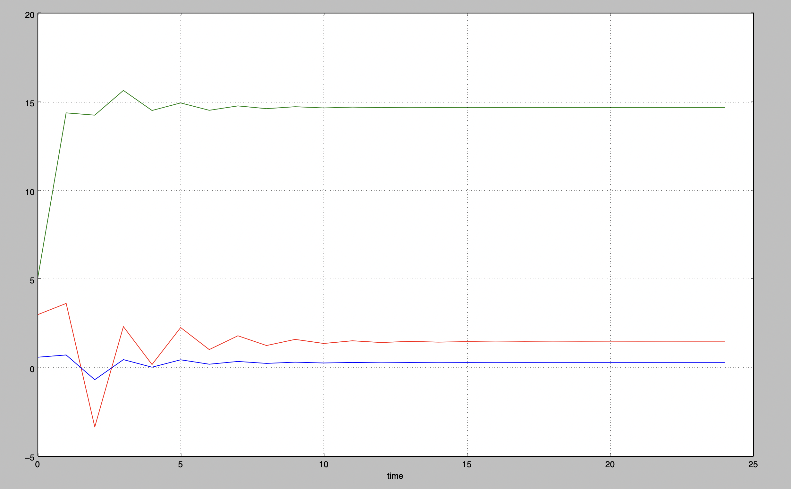
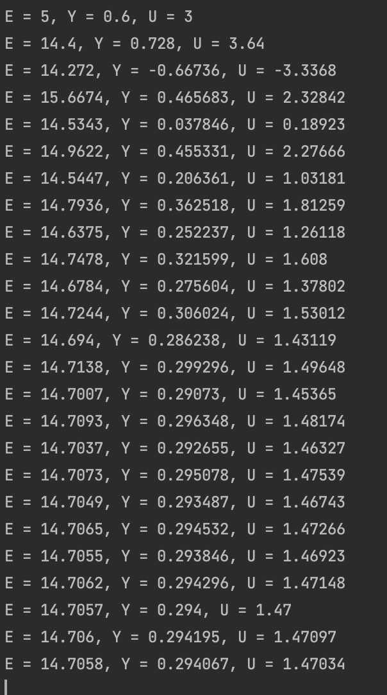
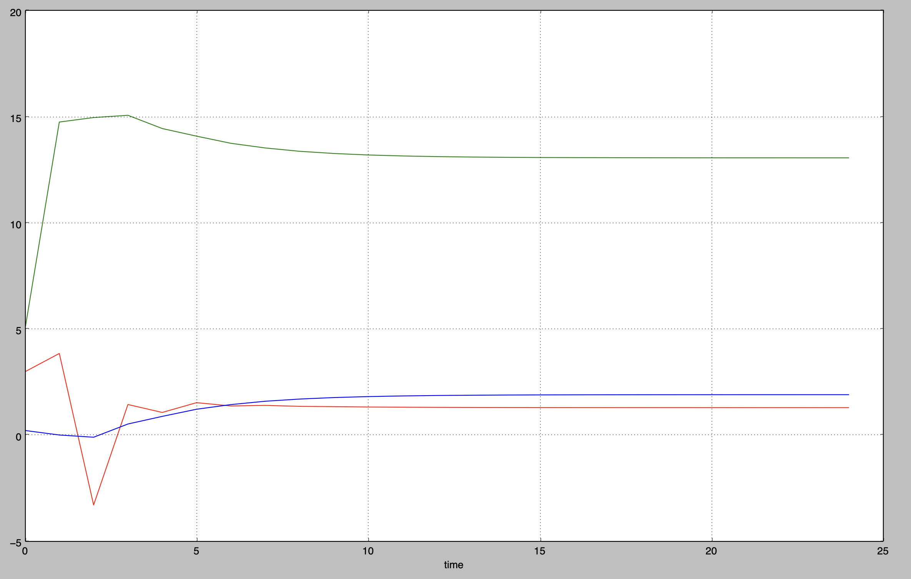
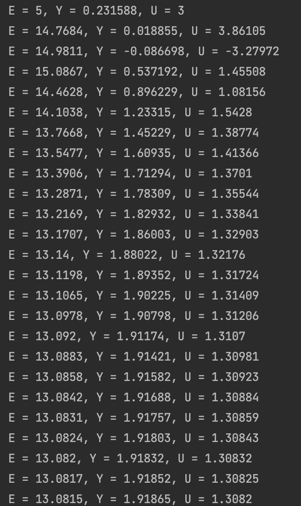

Министерство образования Республики Беларусь
Учреждение образования Брестский Государственный Технический Университет
Кафедра ИИТ
         
## Лабораторная работа №2
## "Математические модели информационных процессов и управления"
###"ПИД-регуляторы"
         
Выполнил:
Студентка 3 курса
Группы АС-59
Пархоць А.В.

Проверил:
Иванюк Д.С.
         
Брест 2022

### Цель работы: контроль температуры объекта
## Ход работы 
## Результат выполнения программы

