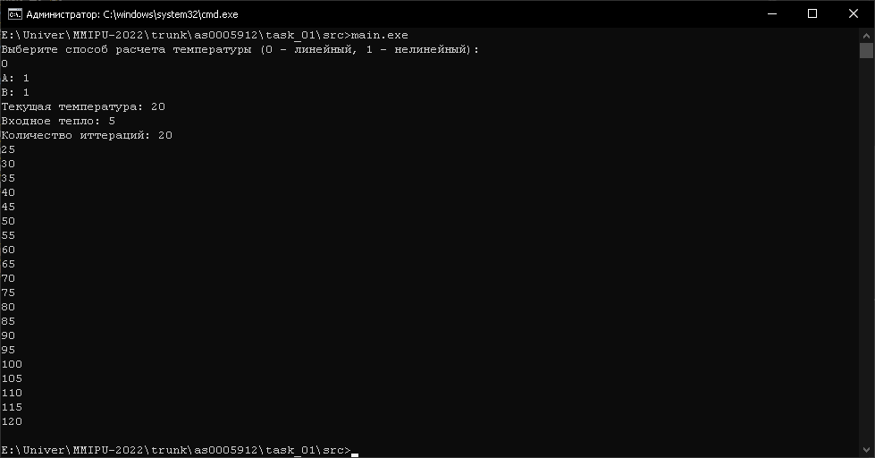
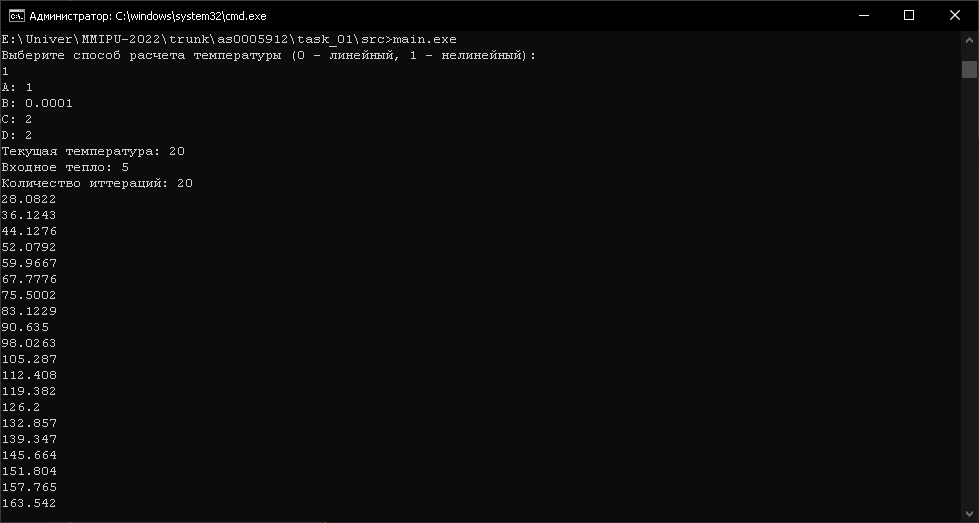
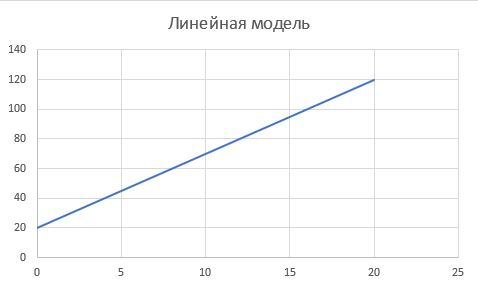

Министерство образования Республики Беларусь    
Учреждение образования Брестский Государственный Технический Университет    
Кафедра ИИТ    
         
## Лабораторная работа №1
### по дисциплине "Математические модели информационных процессов и управления"
### "Моделирование контролируемого объекта"
       
Выполнил: 

Студент 3 курса  
Группы АС-59  
Качан Д. С.  

Проверил:  

Иванюк Д. С.
       
Брест 2022
    

### Цель работы: контроль температуры объекта.
## Ход работы

Константы a, b, c, d в формулах задаются в ходе выполнения программы.  
Были выявлены наиболее подходящие константы.  
Для линейной модели: a = 1, b = 1.  
Для нелинейной модели: a = 1, b = 0.0001, c = 2, d = 2.  

## Результат выполнения программы  

  
  
  
  

