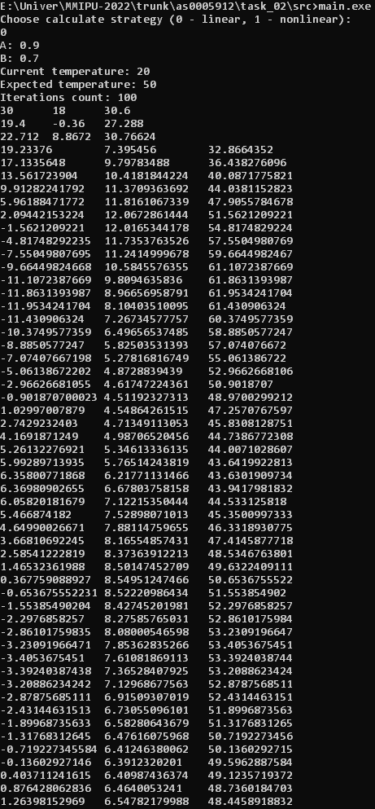
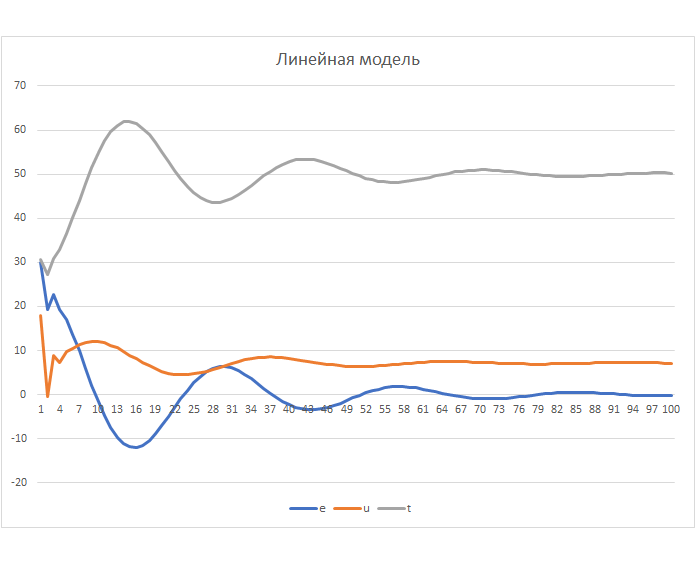

Министерство образования Республики Беларусь    
Учреждение образования Брестский Государственный Технический Университет    
Кафедра ИИТ    
         
## Лабораторная работа №2
### по дисциплине "Математические модели информационных процессов и управления"
### "ПИД-регуляторы"
       
Выполнил: 

Студент 3 курса  
Группы АС-59  
Качан Д. С.  

Проверил:  

Иванюк Д. С.
       
Брест 2022
    

### Цель работы: моделирование ПИД-регулятора для контроля математической модели из 1-ой лабораторной работы.
## Ход работы

Для ПИД-регулятора были выставлены следующие значения T = 10, T0 = 10, TD = 50, K = 0.1.

## Результат выполнения программы  

### Линейная модель
  
  
### Нелинейная модель
  
  
