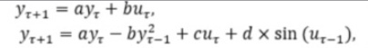
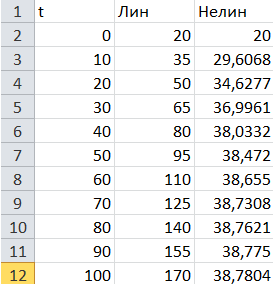

# ***
Лабораторная работа №1 «Моделирование контролируемого объекта»
***

Выполнил: Фоминюк Н. С.  
Проверил: Иванюк Д. С.

## **Цель работы:**

Ммеется некоторый объект, которым можно управлять, и мы хотим контролировать его температуру, которая описывается следующим уравнением:

И далее преобразуется в следующие уравнения:

## **Ход работы:**

Выберем следующие коэффициенты: a = 1, b = 1.5, c = 0.001, d = 0.005, Температуру комнаты примем за 20, коэффициент u примем за константу и возьмём как 1, t = 100.

#### Выберем точки из результатов программы:

#### Графики по полученным данным:
