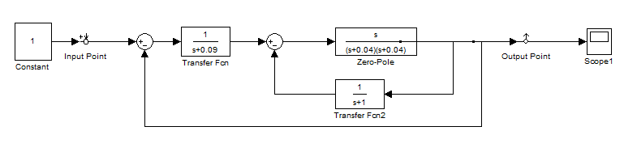
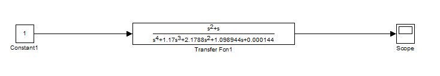
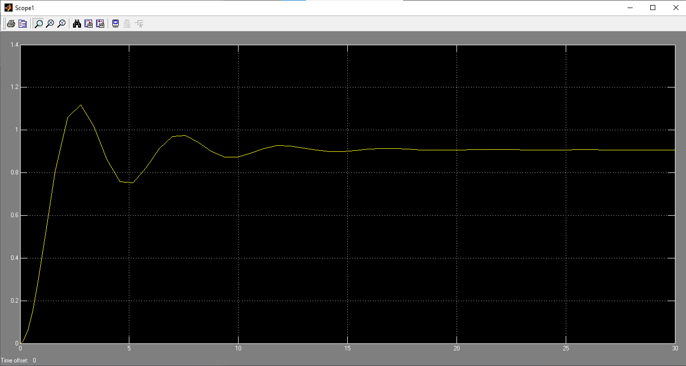
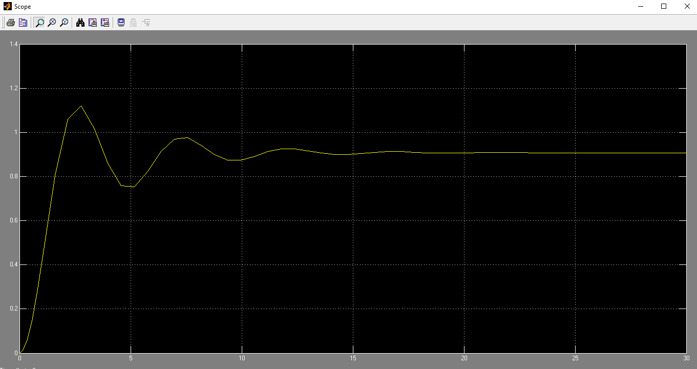
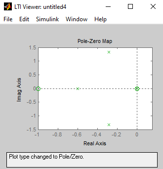
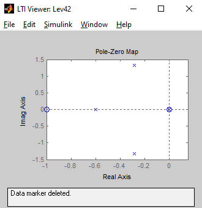

***<h1 align = "center">Преобразование цепей</a>***

Выполнил: Левчук Н.Д

## **Цель работы:**

Преобразовать полученную систему в одноблочную и сравнить ее характеристики с исходной через "LTI-Viewer"

## **Ход работы:**

Начальная схема:

Полученная схема:

График первой схемы:

График второй схемы:

График zero-pole для первой схемы:

График zero-pole для второй схемы:

## **Вывод:**

Соответствия в параметрах на схемах говорят о верном проведенном ппреобразовании исходной системы

