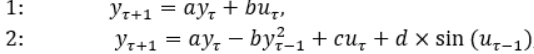
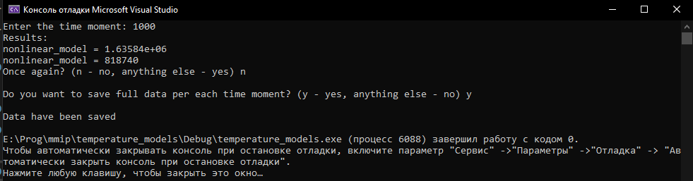
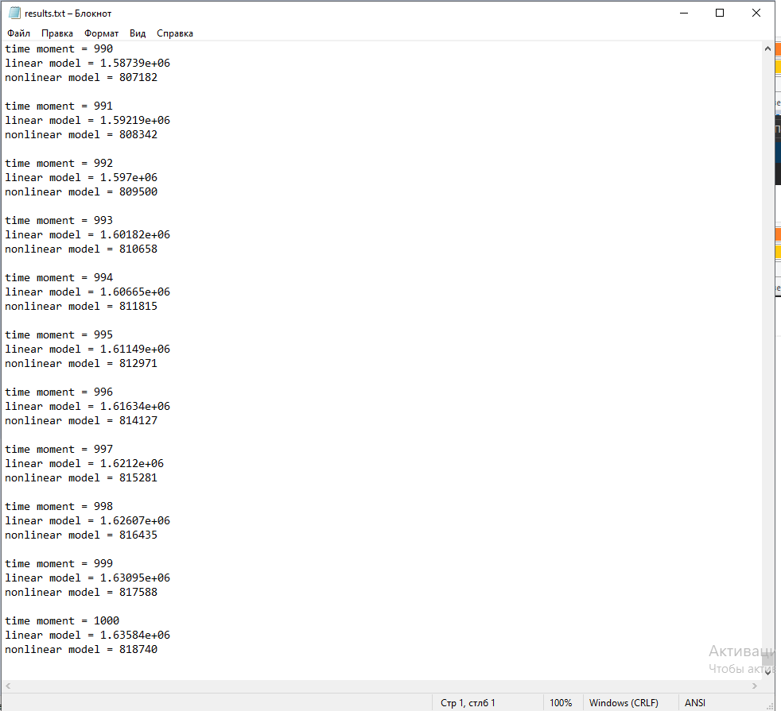
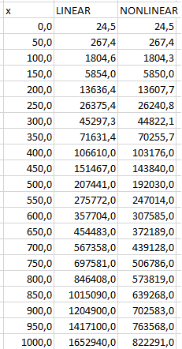
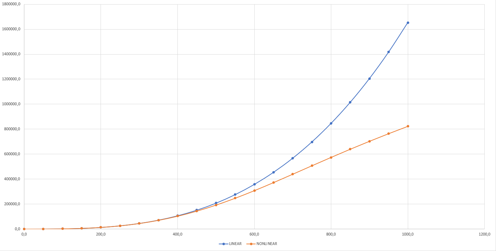

***<h1 align = "center">Лабораторная работа №1 «Моделирование контролируемого объекта»</a>***

Выполнил: Абоимов И.В.

Проверил: Иванюк Д.С.

## **Цель работы:**

имеется некоторый объект, которым можно управлять, и мы хотим контролировать его температуру, которая описывается следующим уравнением:

Где R, C – некоторые константы, Y0 – комнатная температура (примем равной 24,5), у(t) – входящая температура, f(t) = u(t) – входящее тепло.
Решением ДУ выступает:

## **Анализ уравнений:**

Коэффициенты "а" из первого и второго уравнений имеют одно и тоже значение, поскольку они стоят при одних и тех же членах рекуррентной функции (т.е. при y(t)). При этом коэффициенты "b" из первого и второго уравнений являются разными коэффициентами для двух фикций, поскольку стоят при разных членах функции. При этом коэффициент "b" из первого уравнения равен коэффициенту "c" из второго уравнения, так как коэффициенты находятся при одних и тех же членах функции (т.е. при u(t)).

Для получения более-менее «красивых» значений нужно, чтобы коэффициенты "a" и "с" были на порядки больше коэффициентов "b" и "d".  

## **Код программы:**

Исходный код программы находящийся по пути trunk\as005901\task_01\src.  

Результаты работы программы также представлены в отдельном файле - results.txt - помещённом по тому же пути

## **Результаты работы программы:**
  
результаты работы программы  

  
сохранённые результаты в файле  

  
строим график по точкам  
вводим точки  

  
график  

  
## **Вывод**

сымитировали (поскольку u(t) мы задавали сами) контроль температуры объекта. Построили графики для двух моделей, благодаря чему можем их сравнивать их результаты более удобно и эффективно. При этом результаты нелинейной функции должны быть более точными.  

