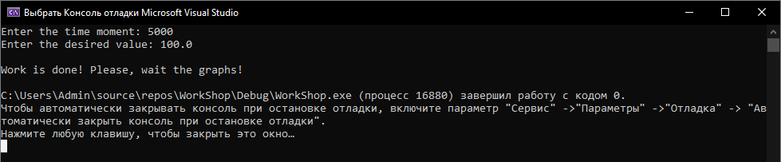
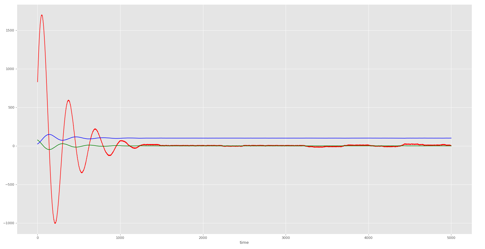

***<h1 align = "center">Лабораторная работа №2 «PID-регуляторы»</a>***

Выполнил: Абоимов И.В.

Проверил: Иванюк Д.С.

## **Цель работы:**

На C++ реализовать программу, моделирующую изображённый на картинке ПИД-регулятор. В качестве объекта управления использовать математическую модель, полученную в предыдущей работе. Использовать ООП, в программе должно быть не менее 3-х классов (+наследование).

Здесь w(t) - алгоритм функционирования системы; u(t) - управляющее воздействие; z(t) - внешние возмущающие воздействия, влияние которых нужно свести к минимуму (пренебрегаем им); y(t) - выходная переменная; e(t) = w(t) - y(t) - отклонение выходной переменной y(t) от желаемого значения w(t).

## **Код программы:**

Исходный код программы находится по пути trunk\as005901\task_01\src.  
  
Результаты работы программы:  
  
  
  
## **Результаты регулирования:**

графики y(t) - выходная температура (синий), e(t) - реакция на скачок (зелёный), u(t) - управляющее воздействие (красный)  

  

  

## **Вывод**

Построил PID-регулятор для нелинейной модели, описанной в предыдущей работе. PID-регулятор выполняет свои функции корректно, т.к. процесс регулирования устойчивая.  

