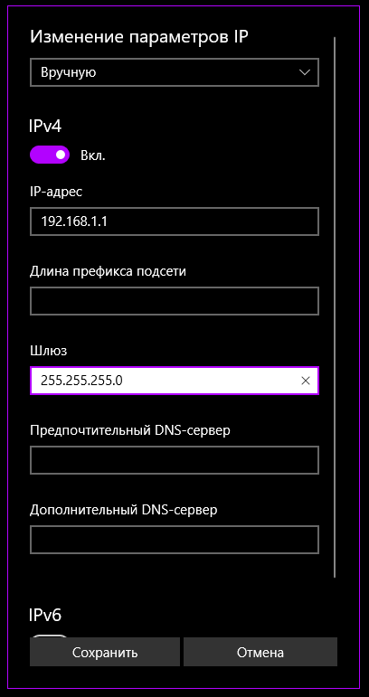
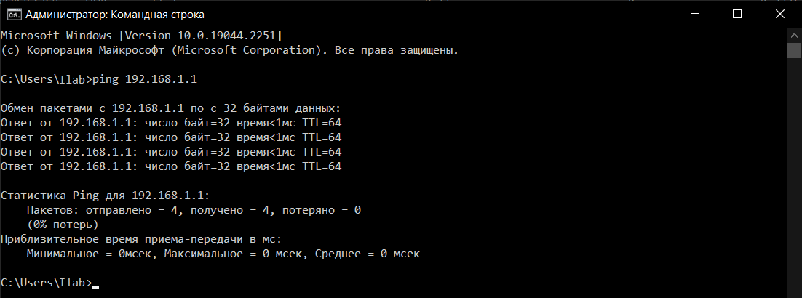
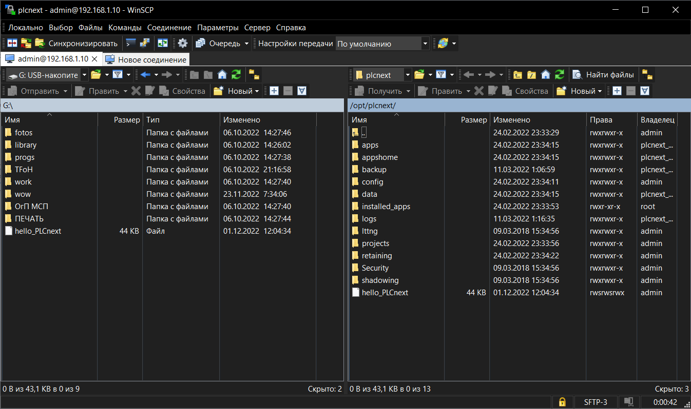
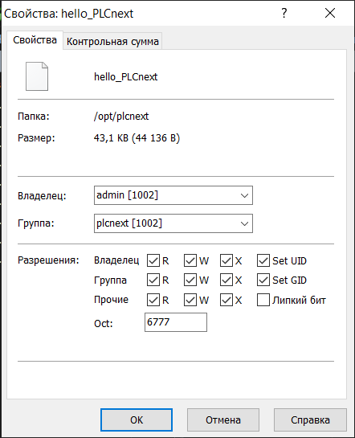
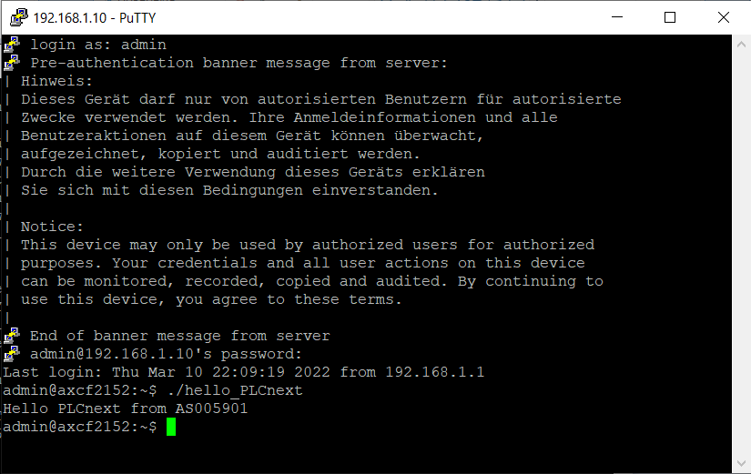

***<h1 align = "center">Работа с контроллером AXC F 2152</a>***

Выполнил: Абоимов И.В.

Проверил: Иванюк Д.С.

## **Цель работы:**

Собрать проект из репозитория и запустить его на контроллере AXC F 215.

## **Ход работы:**

По наставлениям из условий лабораторной работы собрали файл hello_PLCnext, который нам необходимо будет перекинуть в корень контроллера. После чего подключаемся к нему в настройках сети.

  

Далее нам необходимо пропинговать этот IP контроллера, чтобы успешно к нему подключиться. Для этого открываем консоль

  

После этого запускаем программу PuTTY Configuration и подключаемся к контроллеру. 

  

Далее нам необходимо закинуть в корень контролера наш собранный файл. Для этого открываем WinCP. Там вводим имя контролера (admin) и его пароль (****523f).

  

Получаем приглашение и нажимаем продолжить.

  

Перекидываем в корень контролера собраный проект.

  

Однако запустить файл нам не удастся. Чтобы решить данную проблему надо выдать права нашему файлу.

  

 
Теперь только запускаем наш файл.

  
  

  
## **Вывод:**

Научились подключаться к контроллеру и взаимодействовать с ним.

