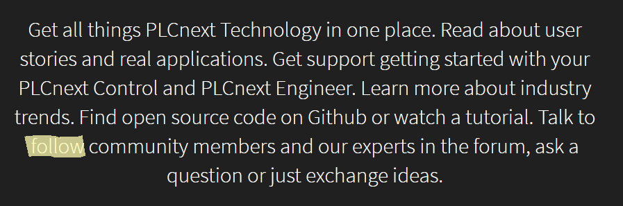

***<h1 align = "center">Работа с проектами</a>***

Выполнили: Абоимов И.В.

## **Цель работы:**

Внести вклад в развитие проекта  

## **Ошибка:**
  
  
  

Слово, в котором допущена ошибка, выделено жёлтым маркером. С ошибкой начало предложения переводится как "Поговорите чтобы подписаться на сообщество...". А имелось ввиду "Поговорите с сообществом единомышленников...". Поэтому вместо follow должно быть fellow.

Ссылка на сайт, где была допущена ошибка:

[PLCnext](https://www.plcnext-community.net)  
  