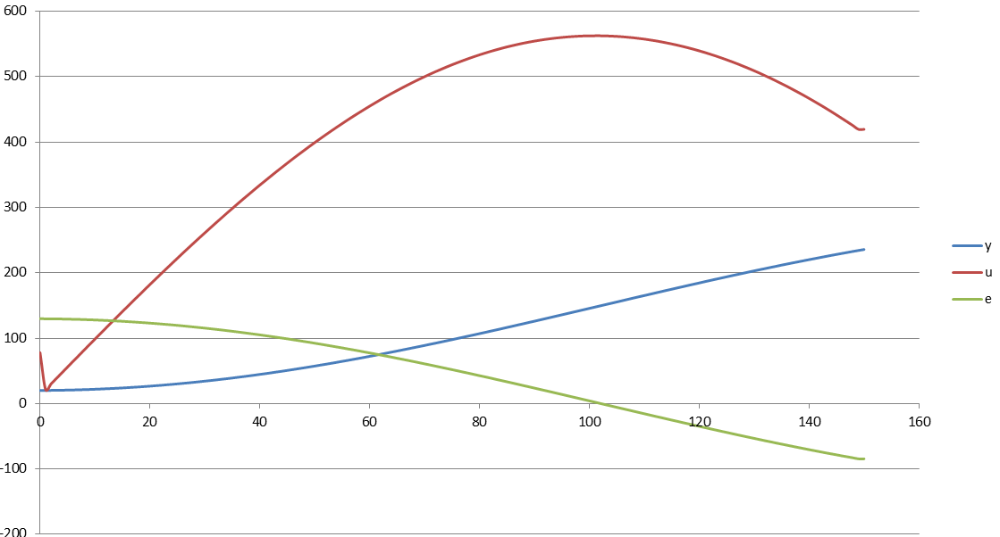
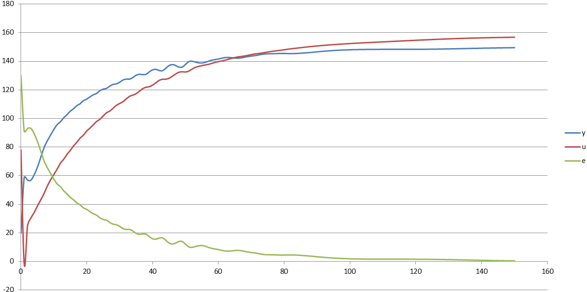

**<h1 align = "center">Министерство образования Республики Беларусь
Учреждение образования Брестский Государственный Технический Университет Кафедра ИИТ</a>**

**_<h1 align = "center">Лабораторная работа №2</a>_**
**_<h1 align = "center">Математические модели информационных процессов и управления. ПИД-регуляторы</a>_**
   

Выполнила: 
Студентка 3 курса 
Группы АС-59 
Бокатюк А.Н. 

Проверил: 
Иванюк Д.С.

Брест 2022

## **Цель работы:**

Контроль температуры объекта.

## **Результат выполнения программы**
## **1)Линейная модель:**

## **2)Нелинейная модель:**

   
Полученные данные хранятся в папке files (внутри папки doc).   

## **Вывод:** описали систему, контролирующую температуру объекта.