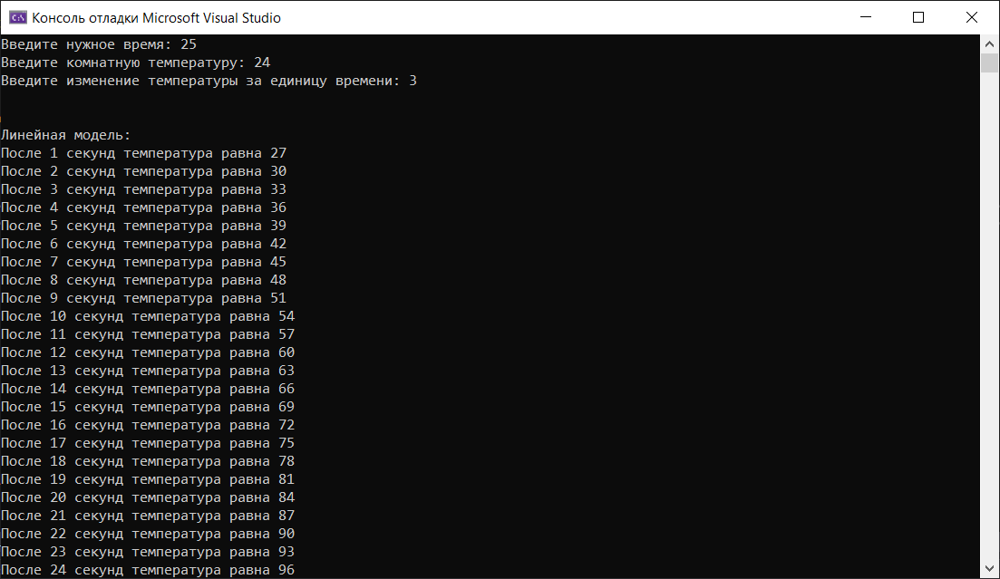
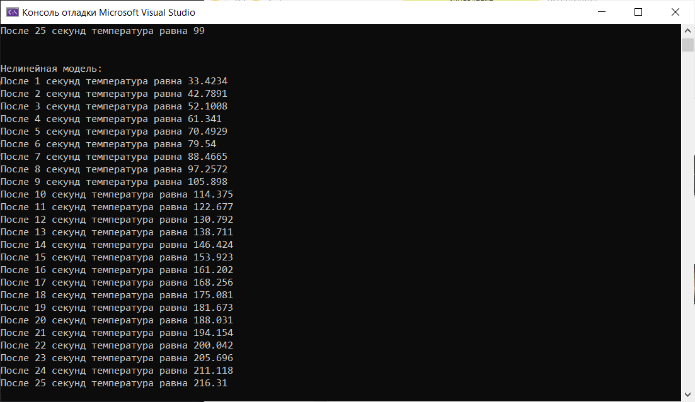
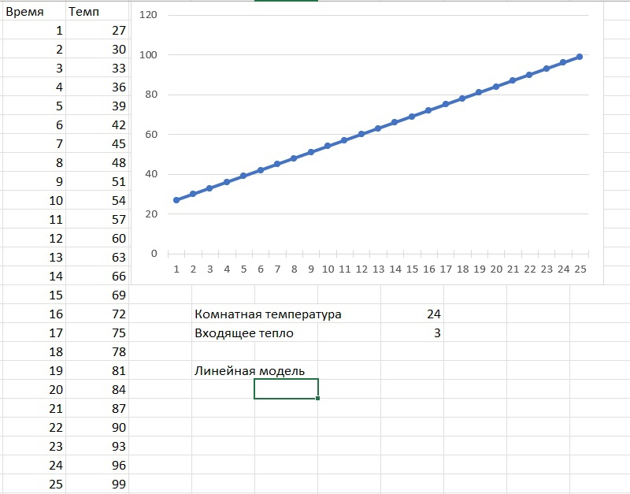
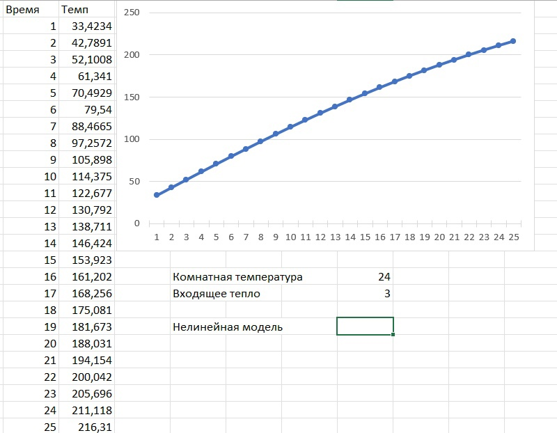

## 
Лабораторная работа №1 «Моделирование контролируемого объекта»

Выполнил: Быбко Т.А. 
Проверил: Иванюк Д.С.

***
### Цель работы
Реализовать линейную и нелинейную модель объекта, температура которого со временем увеличивается.

***

## Код программы:

Исходный код программы находящийся по пути trunk\as005904\task_01\src

## Результаты работы программы:

### Графики функций:

## Вывод
Смоделировал управление температурой объекта, написал программу, построил графики линейного и нелинейного уравнения. 
