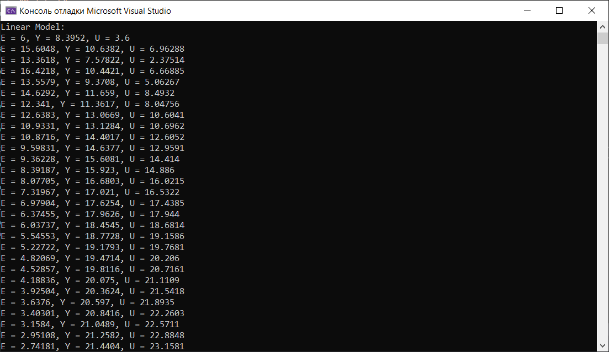
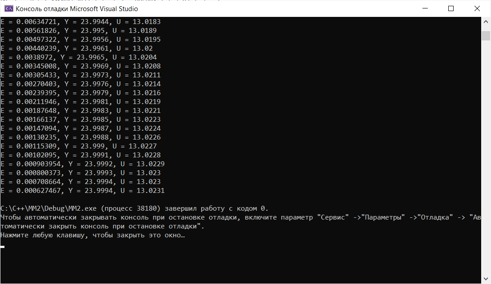
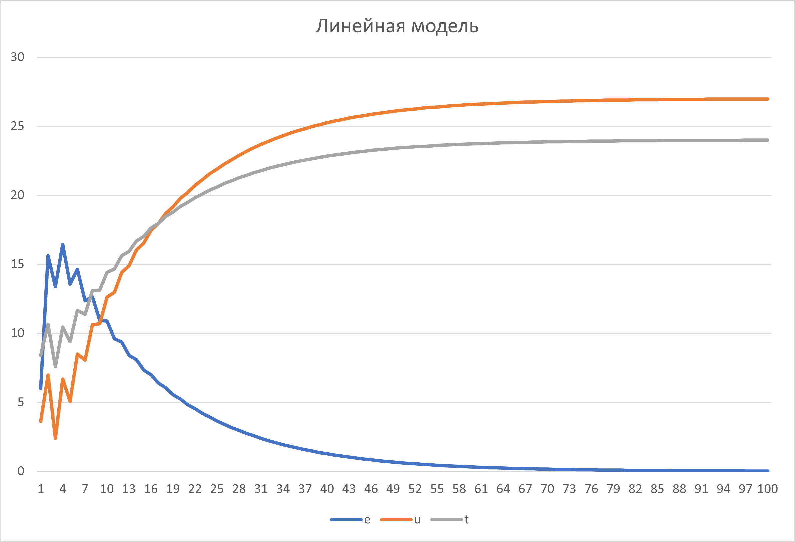

## 
Лабораторная работа №2 «ПИД-регуляторы»

Выполнил: Быбко Т.А. 
Проверил: Иванюк Д.С.

***
### Цель работы
Моделирование ПИД-регулятора для контроля линейной и нелинейной математической модели изменения температуры объекта.
***

## Код программы:

Исходный код программы находящится по пути trunk\as005904\task_02\src

## Результаты работы программы:

### Графики функций:

## Вывод
Смоделировал ПИД-регулятор для контроля линейной и нелинейной математической модели изменения температуры объекта.

