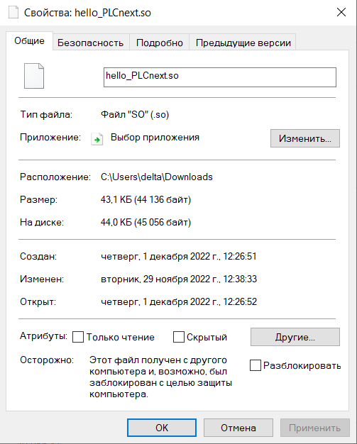
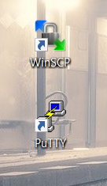
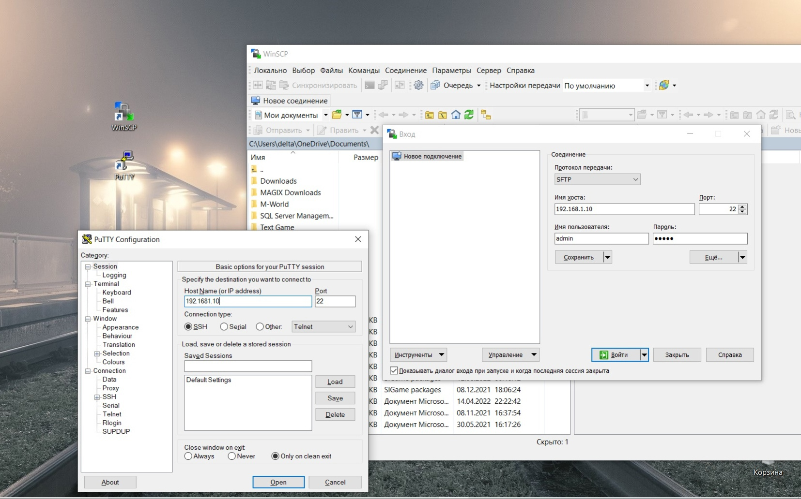
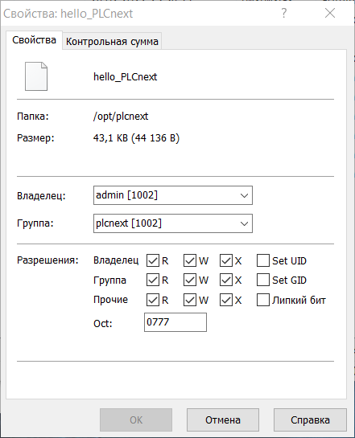
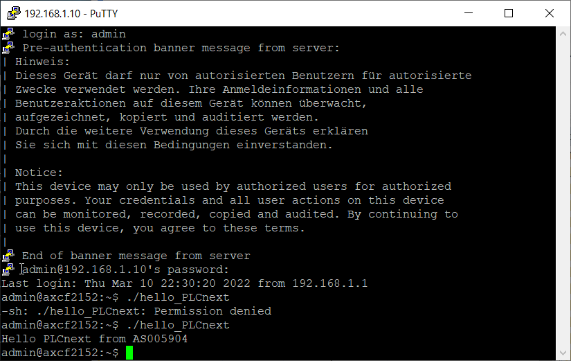

## 
Лабораторная работа №3 «Работа с контроллером AXC F 2152»

Выполнил: Быбко Т.А. 
Проверил: Иванюк Д.С.

***
### Цель работы
Запустить проект на контроллере AXC F 2152.
***

Сперва нужно собрать проект, воспользовавшись методическими указаниями. Если не установлено, то необходимо установить CMake, Cmake Tool и MinGW.   
Через Microsoft Visua Studio открываем PLCnext-howto/HowTo build program/ Hello PLCnext. В cpp файле пишем имя as005904. 
Проект успешно собран.

Далее необходимо подключить контроллер к ноутбуку через LAN-кабель, после чего в настройках сети находим это подключение и устанавливаем IPV4. Задаём свой ip-адресс: 192.168.1.1, маска 255.255.255.0. Проверим есть ли подключение к контроллеру, пропинговав его. Сделать это можно в командной стркое, используя команду ping. Если всё пройдёт успешно и пакеты не будут потеряны, значит соединение установлено верно и можно продолжать работу.

Чтобы продолжить работу, необходимо иметь две программы: WinSCP и PuTTY.

С помощью PuTTY подключаемся к контроллеру. Логин контроллера admin, пароль указан на контроллере: 837b523f.

С помощью программы WinSCP перекидываем собранный проект в корень контроллера. Для этого также нужно будет указать ip-адресс, логин и пароль. После чего можно спокойно перебросить файл.

Убедимся в том, что у нас есть права доступа на запуск файла:

Результат запуска:

## Вывод
Запустил проект на контроллере AXC F 2152.

