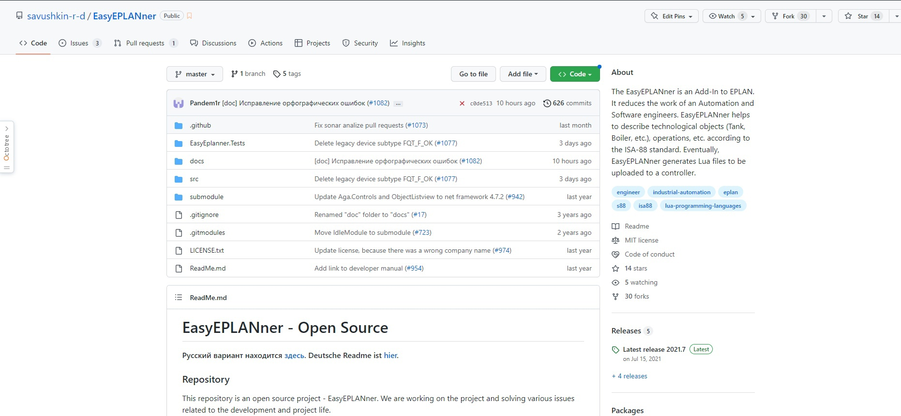
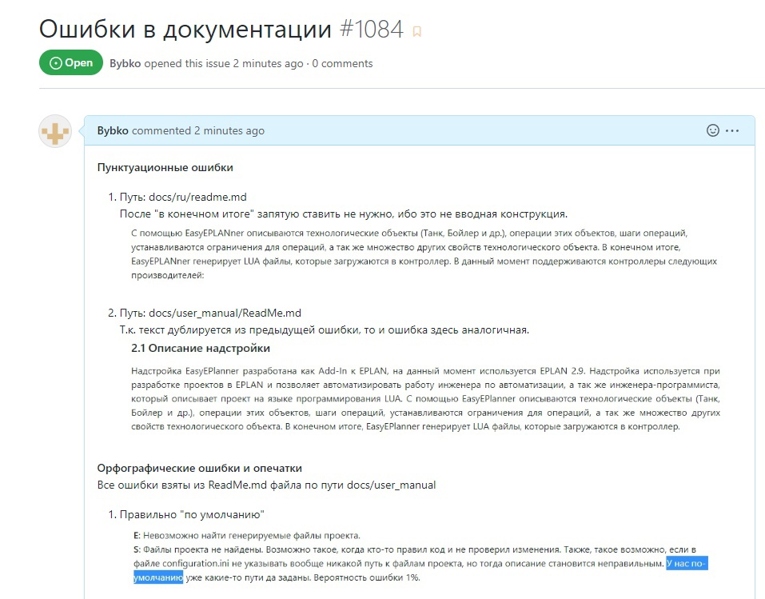
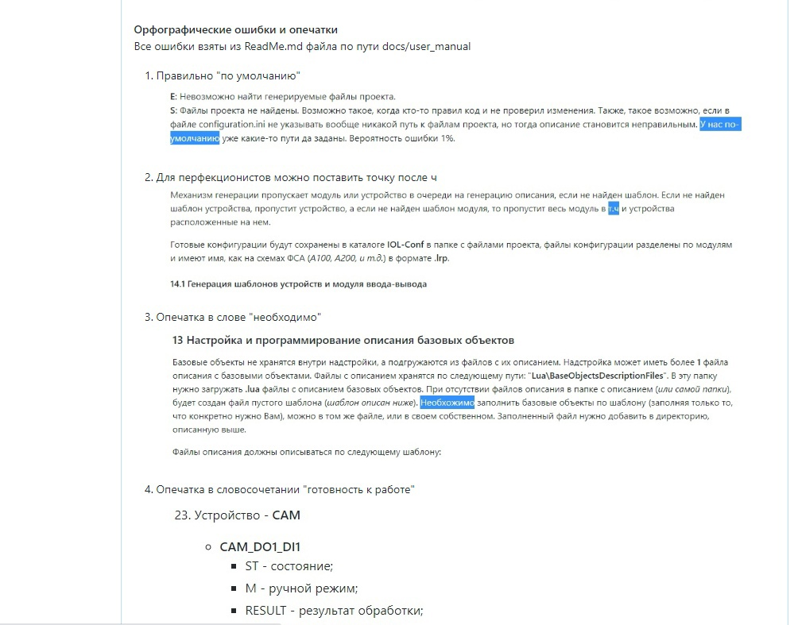
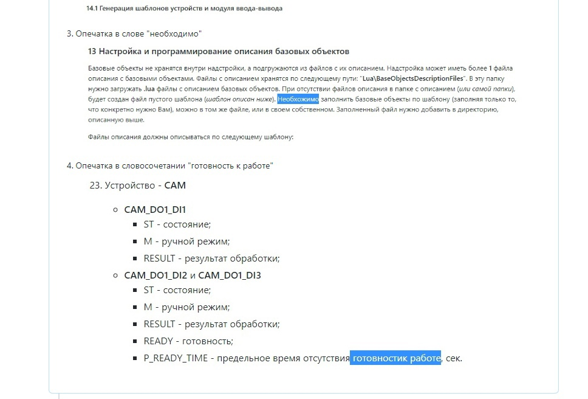

## 
Лабораторная работа №4 «Работа с проектами»

Выполнил: Быбко Т.А. 
Проверил: Иванюк Д.С.

***
### Цель работы
Внести свой вклад в проект
***

Изменения были внесены в данный проект:

В результате был создан пул-реквест со всеми исправлениями:

А также создан issue, в котором описывается каждая найденная ошибка, расположение файла, в котором ошибка найдена и скриншот этой ошибки:

## Вывод
Внёс свой вклад в проект посредством исправления некоторых пунктуационных и орфографических ошибок.

