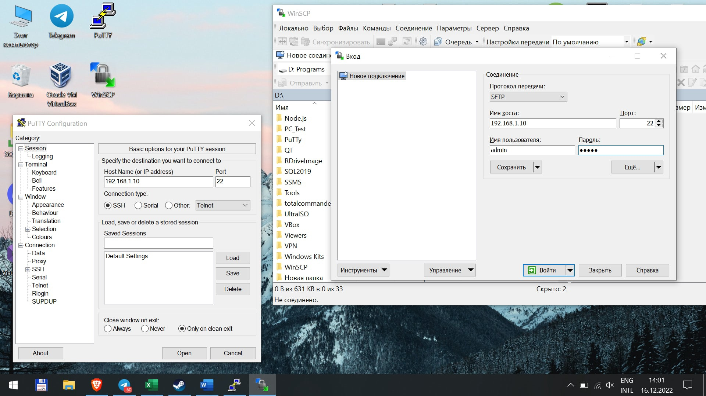
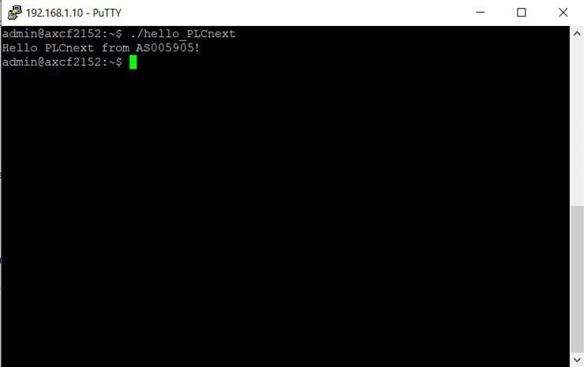

## 
Лабораторная работа №3 «Работа с контроллером AXC F 2152»

Выполнил: Ванюк В.В. 
Проверил: Иванюк Д.С.

***
### Цель работы:
Запустить проект на контроллере AXC F 2152.
***

Соберём проект через Microsoft Visual Studio 2019, используя инстркукцию. Допольнительно нужно иметь CMake, Cmake Tool, MinGW. В cpp файле пишем имя as005905. 

Далее необходимо подключить контроллер к ноутбуку через LAN-кабель. Задаём свой ip-адресс: 192.168.1.1 и маску. Пропингуем контроллер, чтобы проверить наличие подключения через команду ping.

С помощью PuTTY подключаемся к контроллеру. Логин контроллера: admin, пароль указан на контроллере.
С помощью программы WinSCP переносим собранный проект в корень контроллера. Для этого также нужно будет указать ip-адресс, логин и пароль. После чего можно перенести файл.

Ниже приведён скриншот результата всех этих действий:

Результат запуска приведён на скриншоте ниже:

## Вывод:
Изучил информацию о контроллере AXC F 2152 и запустил проект.