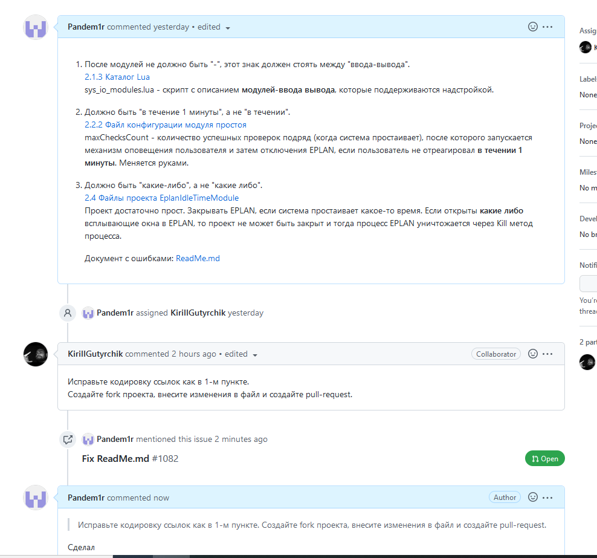
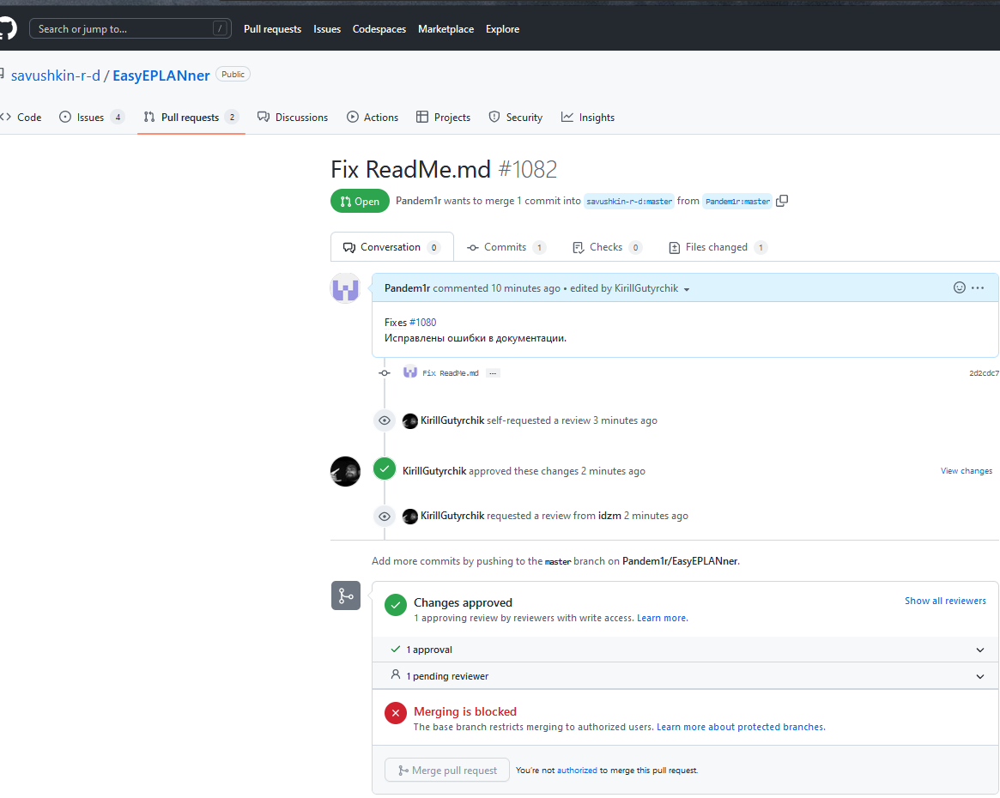

# Лабораторная работа №4 "Работа с проектами"   
Выполнил: Горчинский Н.С.   
Проверил: Иванюк Д.С.  
## Цель работы:  
1. Изучить следующие открытые проекты:

  1.1. Документация работы с технологией [PLCnext](https://www.plcnext-community.net/en/) - [PLCnext-howto](https://github.com/savushkin-r-d/PLCnext-howto);

  1.2. Управляющая программа для контроллеров [PLCnext Control](https://www.phoenixcontact.com/online/portal/de?1dmy&urile=wcm%3apath%3a/dede/web/main/products/subcategory_pages/PLCnext_Controls_P-21-14/30b12f75-d769-4f0e-a783-4986ae3ae247) - [ptusa-main](https://github.com/savushkin-r-d/ptusa_main);

  1.3. Дополнение для [EPLAN Electric P8](https://www.eplan-russia.ru/reshenija-eplan/platforma-eplan/eplan-electric-p8/) - [EPLANner](https://github.com/savushkin-r-d/EasyEPLANner).

2. Внести свой вклад в проект (в виде оформления вопросов (issues)):
- предложить исправления в ошибках в документации (синтаксические, орфографические и т.п.);
- предложить исправления в исходном коде;
- предложить новую функциональность.

## Ход работы  
В ходе изучения предложенных проектов, обнаружил орфографические ошибки и создал issue, в котором указал на них.   

Сделал изменения и pull-request, как попросили сделать

Сам pull-request

