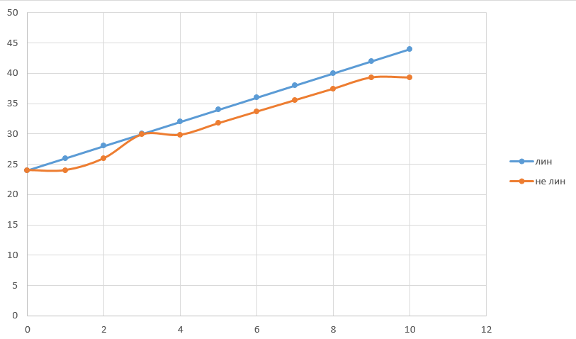
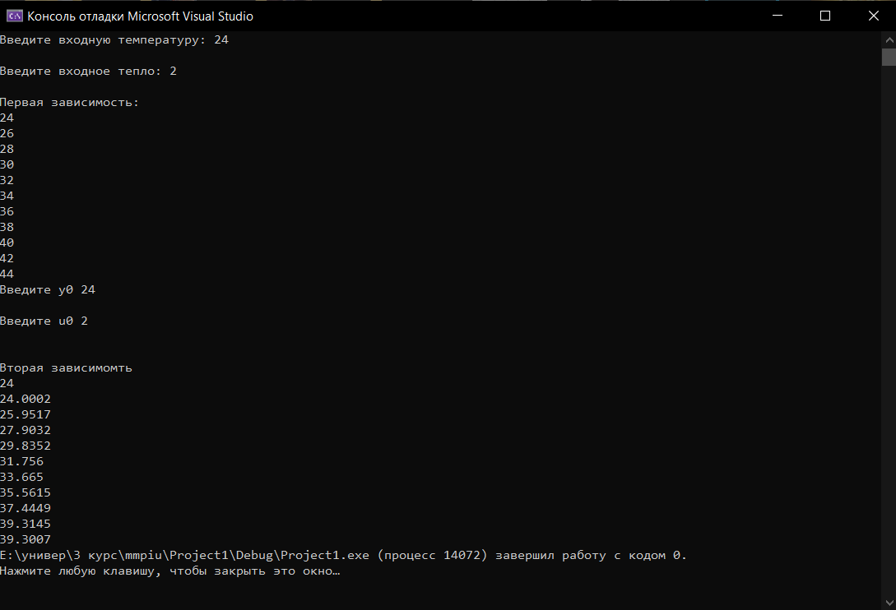

# Лабораторная работа №1 "Modeling controlled object"   
Выполнил: Гриневич А.В.   
Проверил: Иванюк Д.С.  
## Цель работы:  
Построить две зависимости температуры 
## Ход работы  
Реализовал программу на с++, вычисляющую значения температуры для двух зависимостей.
## Результаты  
### По линейной и нелинейной модели:  
  

### Результат программы: 
   

