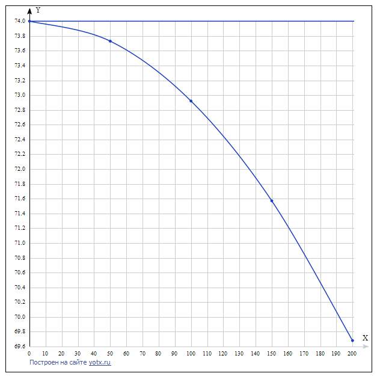

## 
Лабораторная работа №1 «Моделирование контролируемого объекта»

Выполнила: Грицук В.Ю. 
Проверил: Иванюк Д.С.

***
### Цель работы
Реализовать линейную и нелинейную модель объекта, температура которого со временем увеличивается.

***

## Код программы:

Исходный код программы находящийся по пути trunk\as005909\task_01\src

### График функций:

## Вывод
Смоделировала управление температурой объекта, написала программу, построила графики линейного и нелинейного уравнения.
