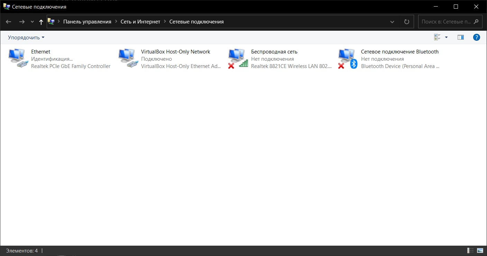
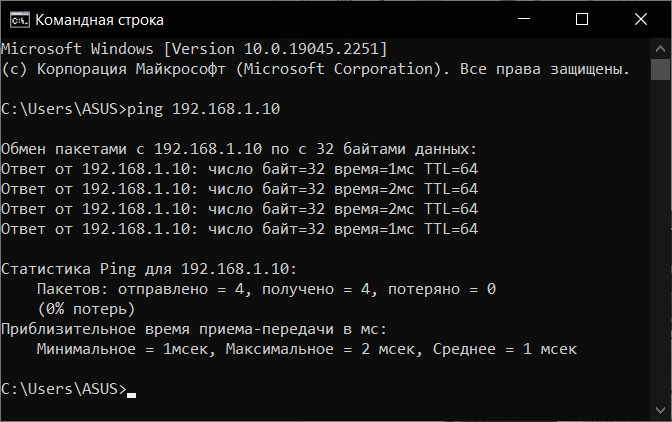
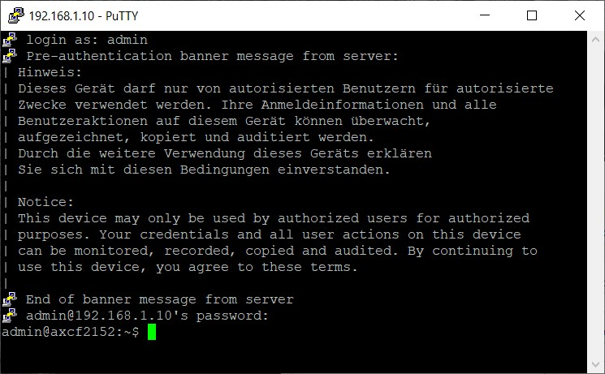
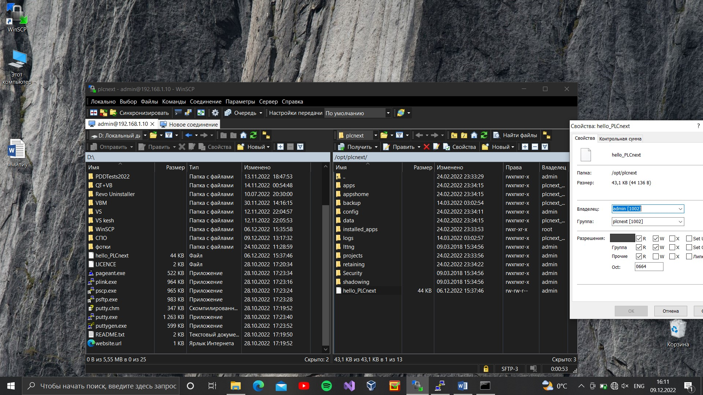
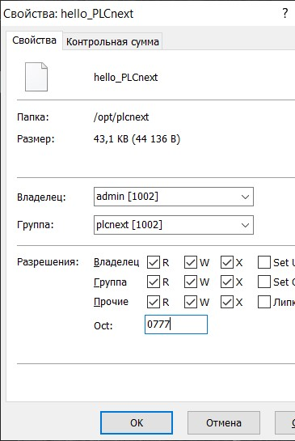
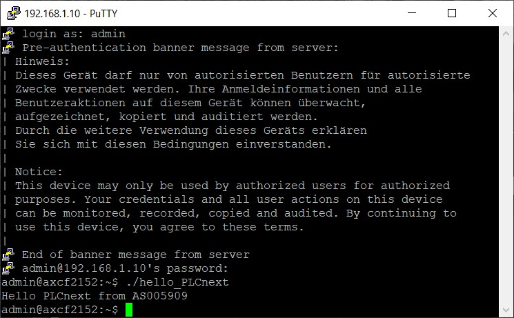
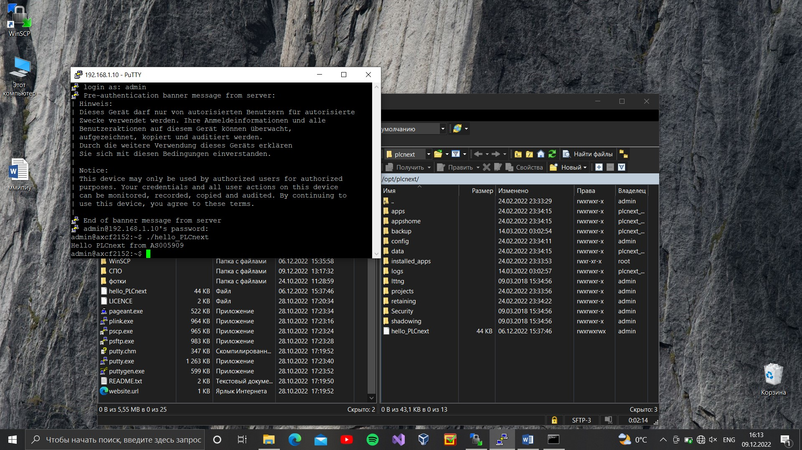

**_<h1 align = "center">«ММИПиУ»</a>_**
**_<h1 align = "center">Лабораторная работа №3 «Работа с контроллером AXC F 2152»</a>_**

Выполнила: Грицук В.Ю.

Проверил: Иванюк Д.С.

## **Процесс работы:**

# 1. собираем проект 

# 2. скачиваем и устанавливаем WinSCP и PuTTY

  
# 3. подключаем контроллер, заходим в "Параметры сети и интернет"

# 4. открываем свойства Ethernet, в свойствах IP версии 4 задаём IP-адрес 

# 5. запускаем командную строку и выполняем команду ping 192.168.1.10

# 6. запускаем PuTTY, вводим логин и пароль 

# 7. запускаем WinSCP, задаём адрес, логин и пароль, а так же удаляем файл hello_PLCnext

# 8. добавляем свой файл hello_PLCnext в корень контроллера, изменяем права доступа

# 9. выполняем ./hello_PLCnext в PuTTY

# 10. в ходе лабораторной были выполнены все требования:
 создан и собран тестовый проект "Hello PLCnext from ASxxyy!" 
 продемонстрирована его работоспособность на тестовом контроллере.