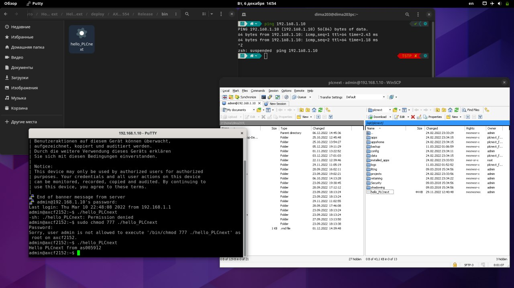

Министерство образования Республики Беларусь    
Учреждение образования Брестский Государственный Технический Университет    
Кафедра ИИТ    
         
## Лабораторная работа №3
### по дисциплине "Математические модели информационных процессов и управления"
### "Работа с контроллером AXCF 2152"
       
Выполнил: 

Студент 3 курса  
Группы АС-59  
Качан Д. С.  

Проверил:  

Иванюк Д. С.
       
Брест 2022
    

### Цель работы: запустить проект на контроллере AXCF 2152
## Ход работы  
Для сборки проекта потребуется установить CMake, Cmake Tool и MinGW.   
В исходном коде меняем выводимый текст на "Hello PLCnext from as005912".  
Перед сборкой нужно установить SDK 2021.0 и в файле CMakeSettings указать путь к нему.
После этого с помощбю CMake собираем проект, использую команды, указанные в методических указаниях.
В результате сборки получаем файл hello_PLCnext.   
Скачиваем программы WinSCP и PuTTy.   
Далее нужно подключится к контроллеру. Для этого подключаем сетевой провод и в настройках подключения указываем IP 192.168.1.1 и маску подсети 255.255.255.0. После этого открываем консоль и вводим команду ping 192.168.1.10, чтобы проверить подключение. Если все прошло успешно, то запускаем PuTTy.   
В PuTTy прописываем IP 192.168.1.10 и подключаемся к контроллеру. После подключения появляется консоль контроллера, в которой нужно авторизоваться. Для авторизации используем логин admin и пароль 837b523f (указан на контроллере). Авторизация прошла успешно и далее запускаем WinSCP.
В WinSCP указываем тот же IP, логин и пароль. После этого получаем доступ к фаловой системе контроллера.   
После входа в файловую систему контроллера копируем наш файл hello_PLCnext на контроллер и даём права на выполнения этого файла всем пользователям.   
Возращаемся в терминал и запускаем скопированный файл командой ./hello_PLCnext. После этого в консоли мы должны увидеть текст "Hello PLCnext from as005912".   

