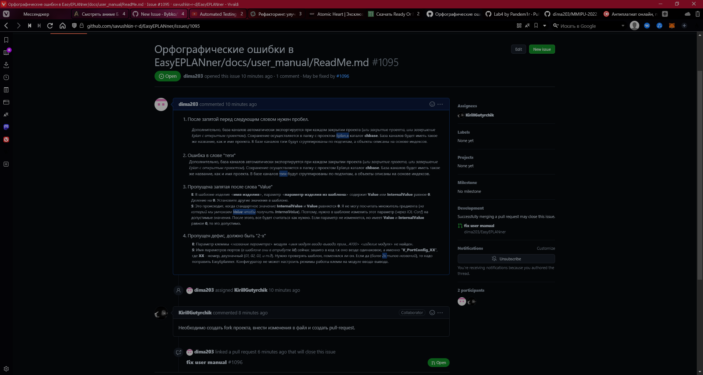
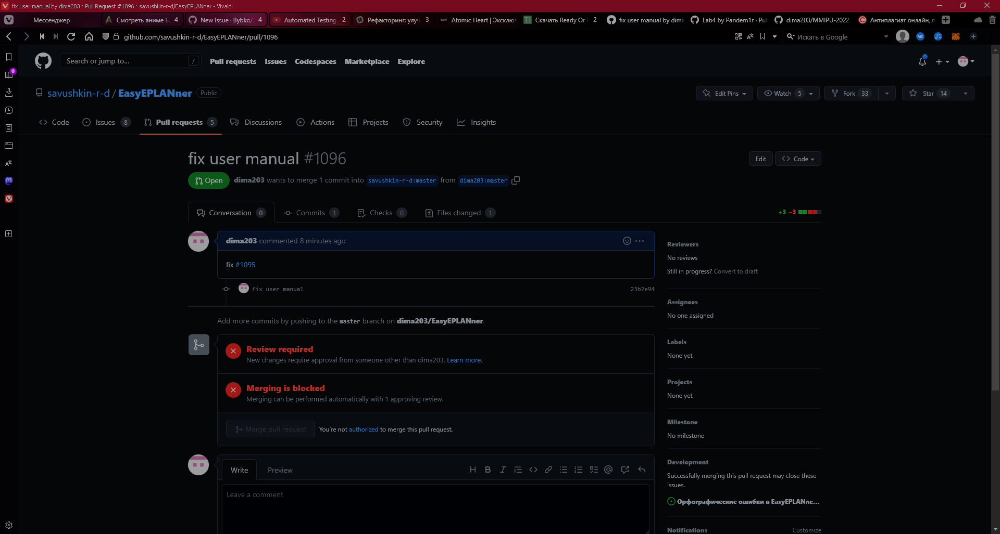

Министерство образования Республики Беларусь    
Учреждение образования Брестский Государственный Технический Университет    
Кафедра ИИТ    
         
## Лабораторная работа №3
### по дисциплине "Математические модели информационных процессов и управления"
### "Работа с контроллером AXCF 2152"
       
Выполнил: 

Студент 3 курса  
Группы АС-59  
Качан Д. С.  

Проверил:  

Иванюк Д. С.
       
Брест 2022
    

## Цель работы:  
1. Изучить следующие открытые проекты:

    + Документация работы с технологией [PLCnext](https://www.plcnext-community.net/en/) - [PLCnext-howto](https://github.com/savushkin-r-d/PLCnext-howto);

    + Управляющая программа для контроллеров [PLCnext Control](https://www.phoenixcontact.com/online/portal/de?1dmy&urile=wcm%3apath%3a/dede/web/main/products/subcategory_pages/PLCnext_Controls_P-21-14/30b12f75-d769-4f0e-a783-4986ae3ae247) - [ptusa-main](https://github.com/savushkin-r-d/ptusa_main);

    + Дополнение для [EPLAN Electric P8](https://www.eplan-russia.ru/reshenija-eplan/platforma-eplan/eplan-electric-p8/) - [EPLANner](https://github.com/savushkin-r-d/EasyEPLANner).

2. Внести свой вклад в проект (в виде оформления вопросов (issues)):
    + предложить исправления в ошибках в документации (синтаксические, орфографические и т.п.);
    + предложить исправления в исходном коде;
    + предложить новую функциональность.

## Ход работы  
Изучил проекты и нашел ошибки в руководстве пользователя в проекте "Дополнение для [EPLAN Electric P8](https://www.eplan-russia.ru/reshenija-eplan/platforma-eplan/eplan-electric-p8/) - [EPLANner](https://github.com/savushkin-r-d/EasyEPLANner)".

Сделал issue, где описал ошибки

Сделал fork, исправил указанные ошибки и открыл Pull Request

