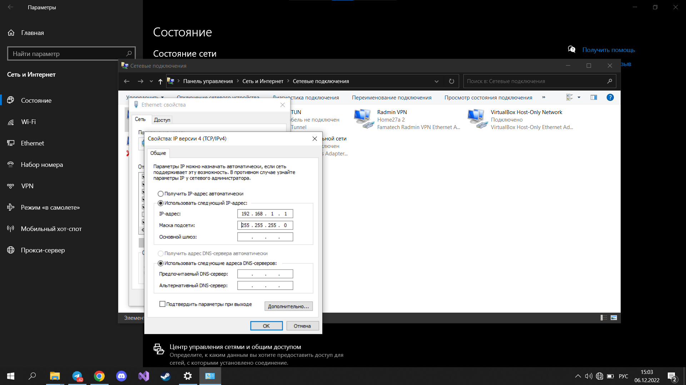
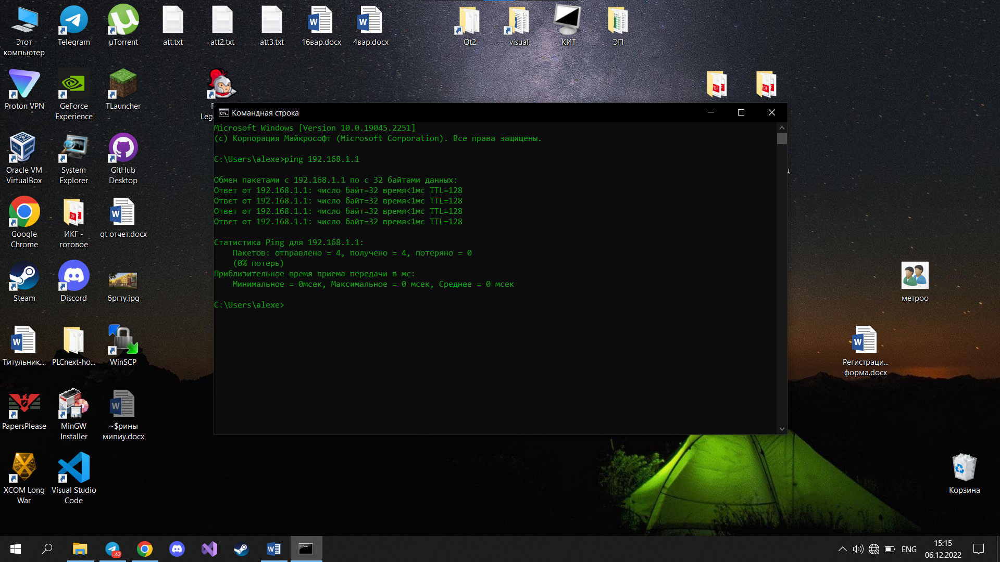
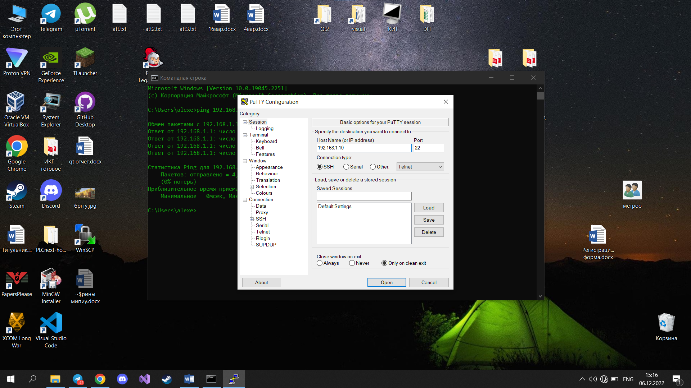
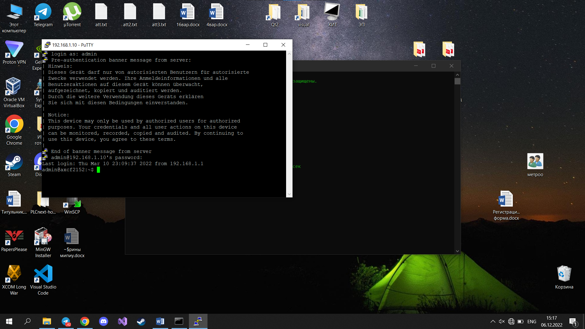
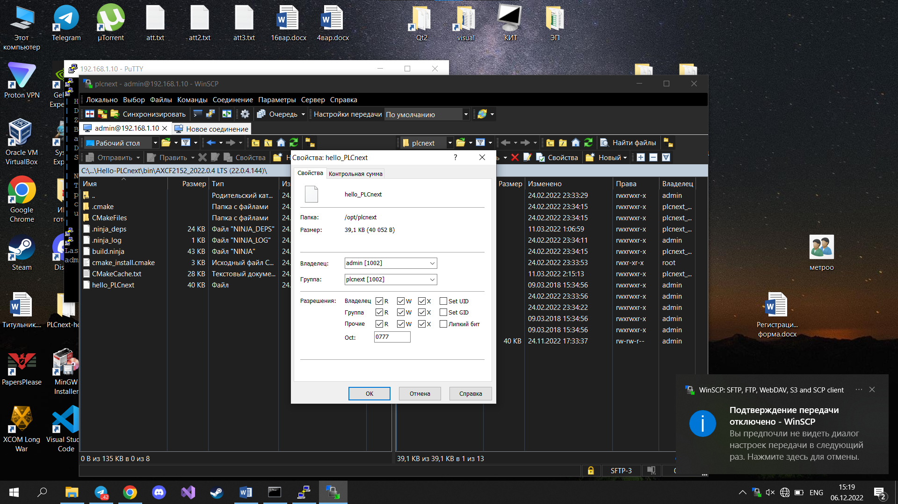
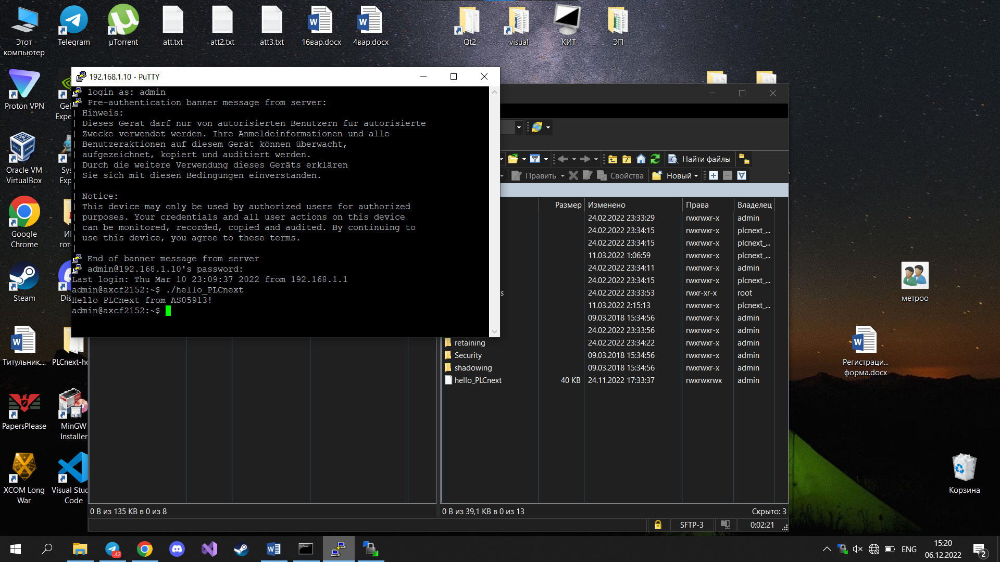

## 
Лабораторная работа №1 «Работа с контроллером **AXC F 2152**

Выполнил: Кивака А.В. 
Проверил: Иванюк Д.С.

***
### Цель работы
Изучить руководство. Используя MS Visual Studio создать тестовый проект "Hello PLCnext from AS005913!", собрать его и продемонстрировать работоспособность на тестовом контроллере.

 ### 
Ход работы

Включаем контроллер в розетку. Подключаем контроллер с помощью Lan-кабеля.
Далее в настройках сети выбираем появившееся Ethernet подключение, открываем его свойства и вводим IP и маску подсети такие, как показано на фото

  
Далее необходимо проверить соединение с помощью консольной команды **ping** и написав соответствующий IP-адрес

  
Запускаем **PuTTY**, записываем IP-адрес контроллера, нажимаем **open**

  
Открывается окно консоли, в котором надо написать имя пользователя **admin**. Затем нужно написать пароль, который написан на контроллере.

  
Запускаем **WinSCP**

  
Перемещаем файл сборки в память контроллера. Все права доступа разрешаем

  
В **PuTTY** запускаем данный файл

  
Работа с контроллером окончена. После завершения работы необходимо удалить добавленный файл из памяти контроллера, отключить LAN-кабель и контроллер из розетки.