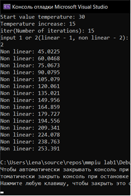
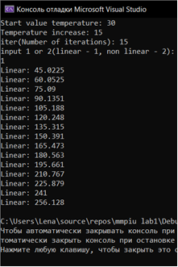
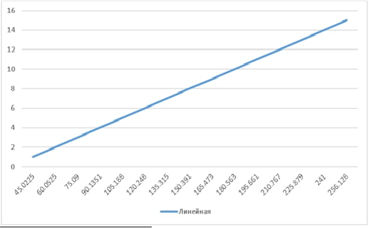
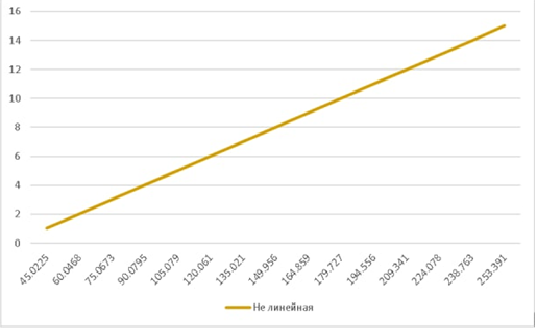

***<h1 align = "center">Лабораторная работа №1 «Моделирование контролируемого объекта»</a>***

Выполнила: Коверец Е.Д.

Проверил: Иванюк Д.С.

## **Результаты работы программы:**
  
Результат работы

  
График линейной функции

  
График нелинейной функции

