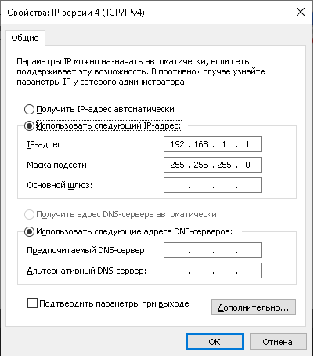
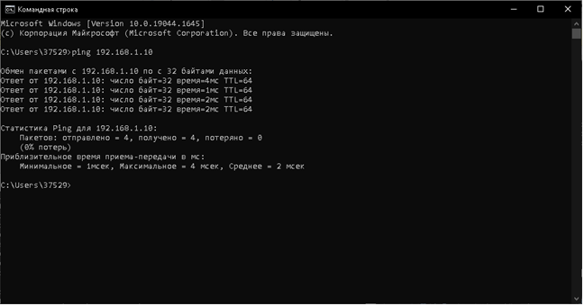
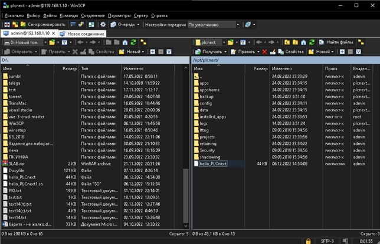
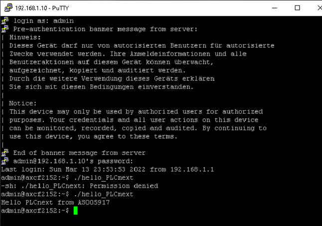

**_<h1 align = "center">Лабораторная работа №3</a>_**
**_<h1 align = "center">Запуск проекта на контроллере AXC F 215</a>_**

Выполнила: Коверец Е.Д.

Проверил: Иванюк Д.С.

## **Цель работы:**

Собрать проект и запустить его на контроллере AXC F 215.

## **Ход работы:**

Собираем файл hello_PCLnext в редакторе VScode. Для работы с контроллером нам необходимо установить программы PuTTY и winSCP. 
Первый шаг: необходимо изменить настройки сети. 
 
Второй шаг: открываем терминал и устанавливаем соединение с помощью команды ping. 
 
Третий шаг: заходим в PuTTY и прописываем адрес 192.168.1.10. Вводим логин и пароль. 
Четвертый шаг: заходим в winSCP и так же узаываем адрес, логин и пароль. 
Пятый шаг: перемещаем свой файл hello_PCLnext в корень контроллера и изменяем права доступа. 
 
Шестой шаг: запускаем ./hello_PCLnext 
 

Готово! 

В ходе работы забыла изменить права доступа, в результате чего получила ошибку permission denied. 
 

## **Вывод:**

Получила опыт работы с контроллером

