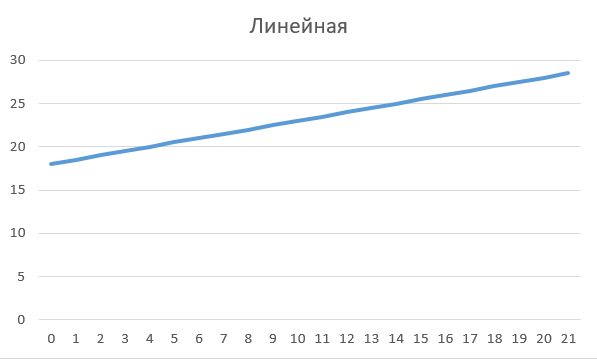
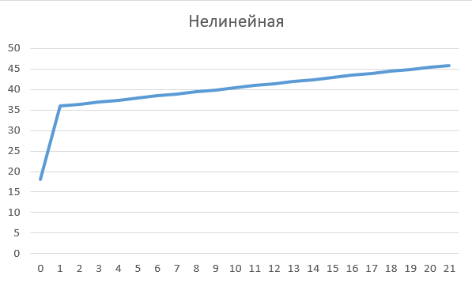

## 
Лабораторная работа №1 «Моделирование контролируемого объекта»

Выполнил: Кулиш С.Ю. 
Проверил: Иванюк Д.С.

***
### Цель работы
Пусть есть некоторый объект, которым можно управлять, и мы хотим контролировать его температуру, которая описывается следующим уравнением:

Где R, C – некоторые константы, Y0 – комнатная температура (примем равной 18), у(t) – входящая температура, f(t) = u(t) – входящее тепло. Решением ДУ выступает:

***

## Код программы:

Исходный код программы находящийся по пути trunk\as005917\task_01\src.

### Вывод в текстовые файлы:

### Графики функций:

## Вывод
Смоделировали управление температурой объекта, написали программу, построили графики линейного и нелинейного уравнения. 

