## 
Лабораторная работа №3 Работа с контроллером AXC F 2152

Выполнил: Левоцкий Н.Д. 
Проверил: Иванюк Д.С.

***
### Цель работы
Изучить руководство.

Используя MS Visual Studio создать тестовый проект "Hello PLCnext from AS05917", собрать его и продемонстрировать работоспособность на тестовом контроллере. 

***
## Ход работы:
1. Изначально имеем папку src и файл main.cpp

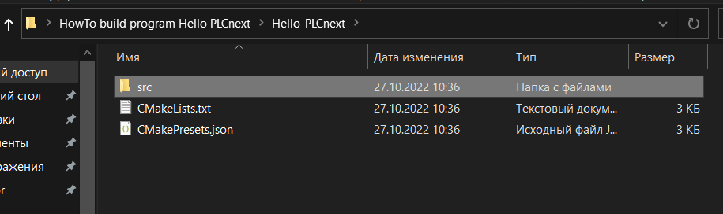

2. С официального сайта скачиваются CLI toolchain и SDK package для контроллера AXCF2152 и устанавливаем расширение для Visual Studio 2019

3. С помощью сборщика CMake собираем программу и получаем следующий результат

### Результат сборки программы 

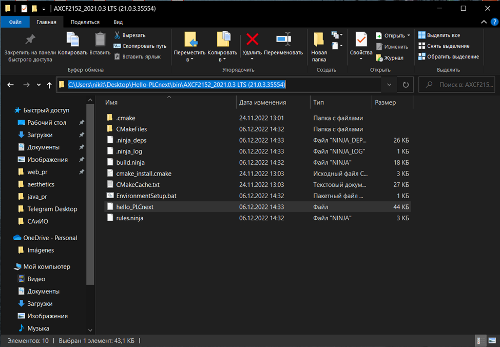

4. Подключаем контроллер AXCF2152 к компьютеру по LAN-порту

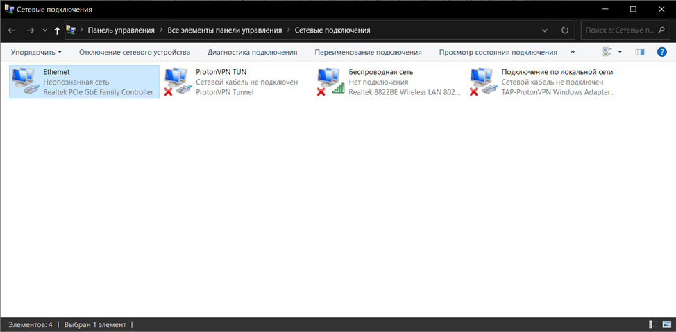

Устанавливаем новому устройству IP адрес 192.168.1.1

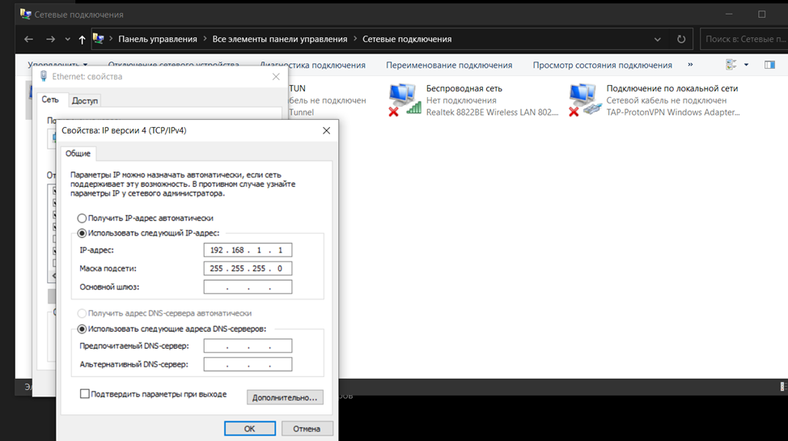

5. С помощью утилиты ping осуществяем обмен пакетами с контроллером, проверяя тем самым соединение

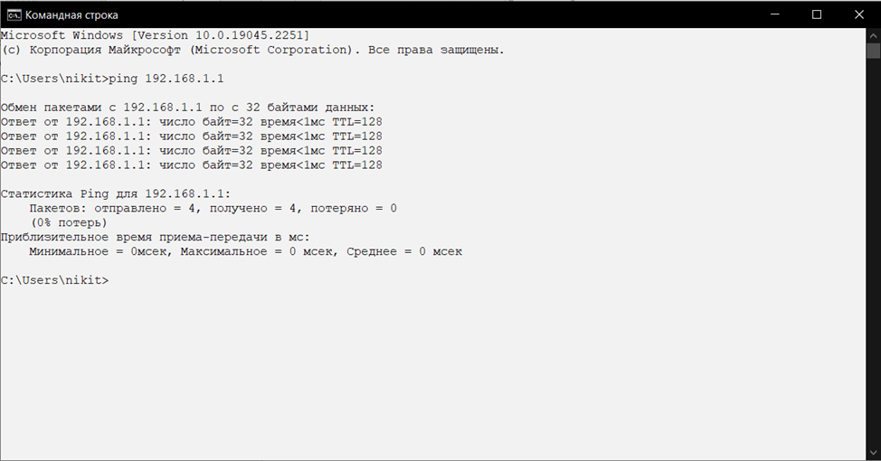

Соединение установлено

6. Используя утилиту PuTTY подключаемся к контроллеру. PuTTY позволяет подключиться и управлять удаленным узлом (например, сервером). В PuTTY реализована только клиентская сторона соединения — сторона отображения, в то время как сама работа выполняется на стороне сервера.

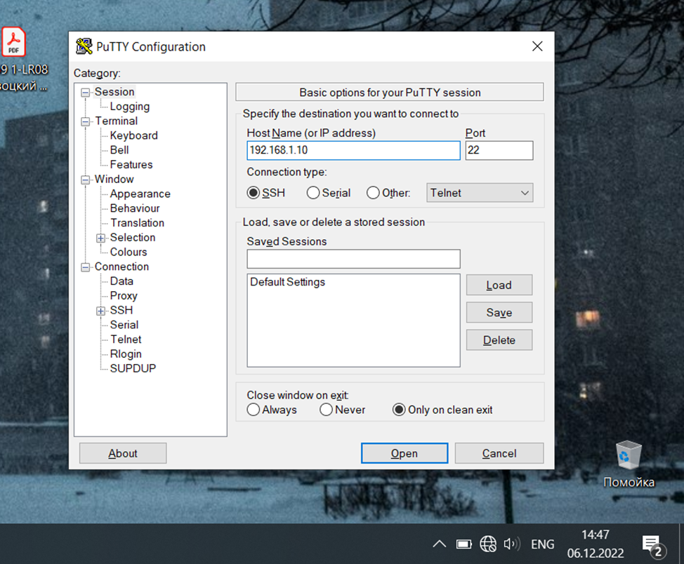

7. Аутентификация

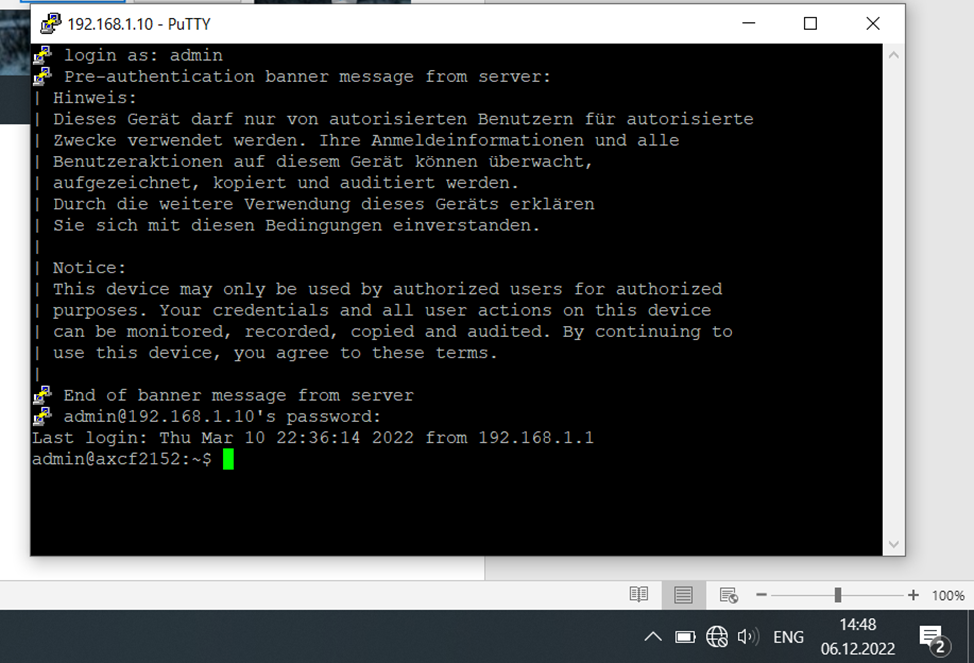

8. С помощью утилиты WinSPC подключаемся к контроллеру

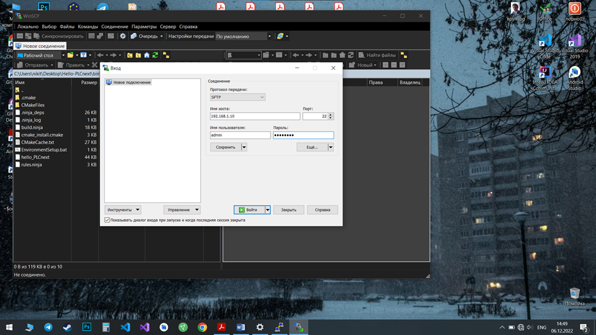

9. Можно видеть файлы, хранящиеся в контроллере

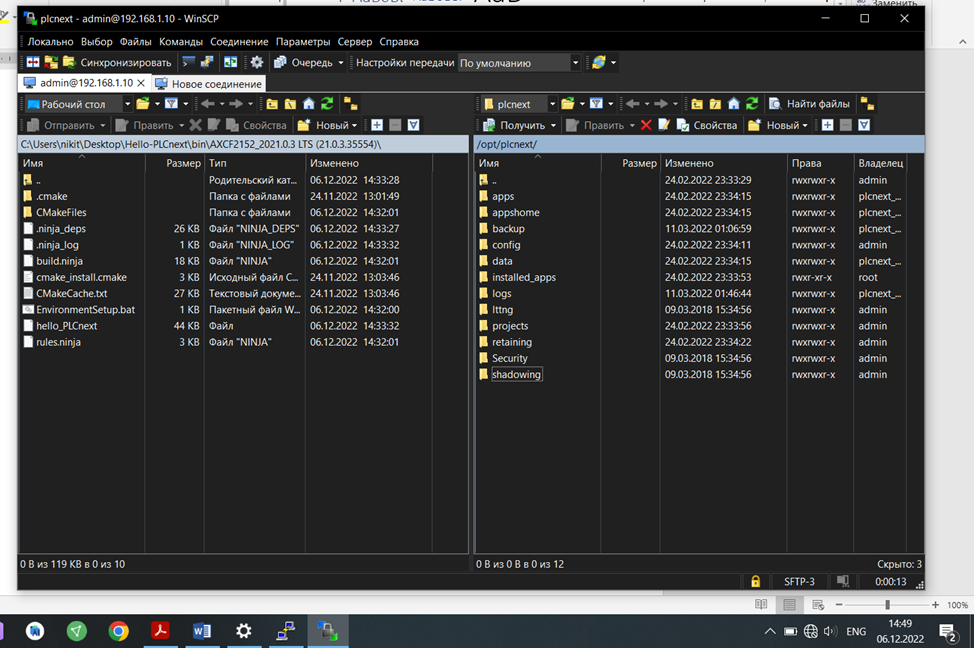

10. Перемещаем файл hello_PLCnext и меняем права доступа, разрешая чтение, изменение и выполнение для всех видов пользователей

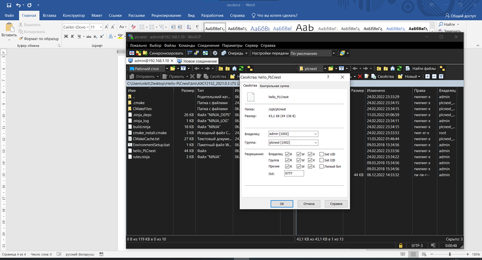

11. Выполняем программу

## Результаты работы программы:

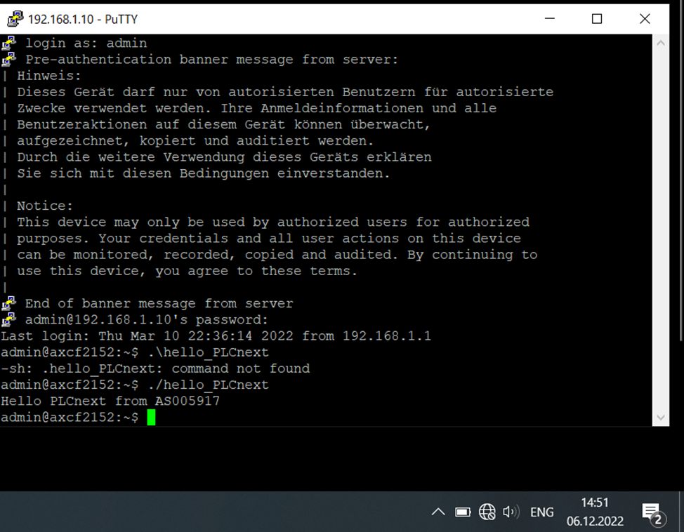

## Вывод
Изучил руководство к контроллеру AXCF2152, создал тестовый проект Hello-PLCNext и собрал его, запустил программу на тестовом контроллере.

