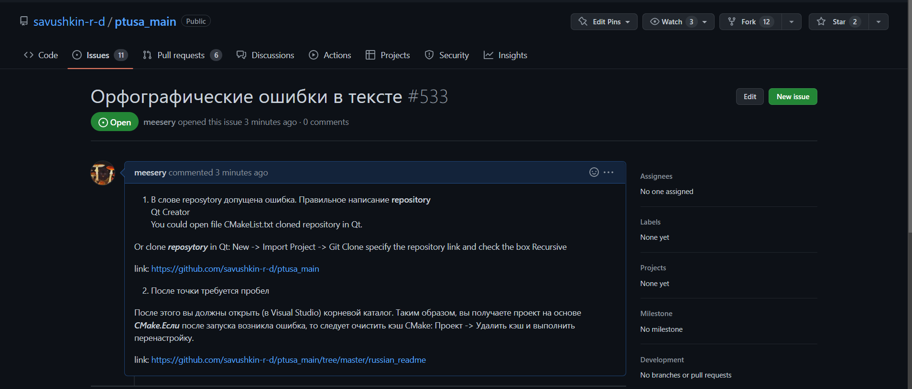
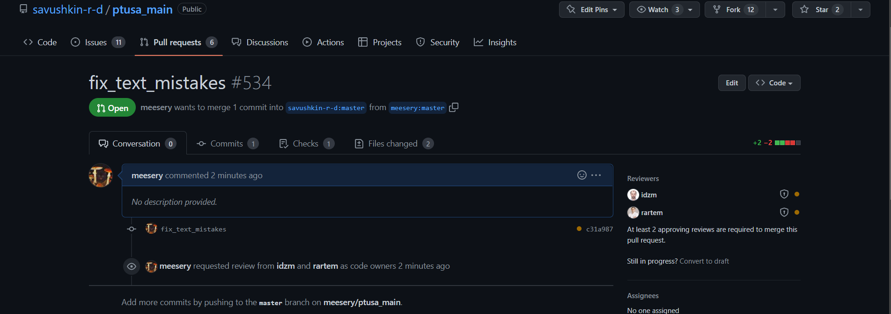

## 
Лабораторная работа №4 «Работа с проектами»

Выполнил: Левоцкий Н.Д. 
Проверил: Иванюк Д.С.

***
### Цель работы
Изучить следующие открытые проекты:
1.1. Документация работы с технологией PLCnext - PLCnext-howto;

1.2. Управляющая программа для контроллеров PLCnext Control - ptusa-main;

1.3. Дополнение для EPLAN Electric P8 - EPLANner.

Внести свой вклад в проект (в виде оформления вопросов (issues)):
предложить исправления в ошибках в документации (синтаксические, орфографические и т.п.);
предложить исправления в исходном коде;
предложить новую функциональность.

Ход работы

В ходе изучения readme файлов репозитрория управляющей программы для контроллеров PLCnext Control - ptusa-main были найдены орфографическая и синтаксическая ошибка

1. Issue

2. Pull request

## Вывод
Внёс свой вклад в проект в виде оформления вопроса, предложил исправление орфографических и синтаксических ошибок.

