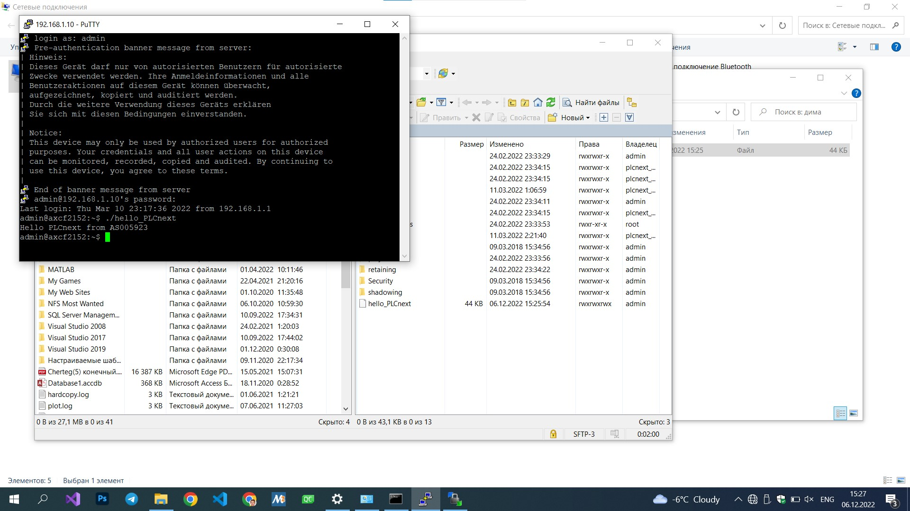

Министерство образования Республики Беларусь
Учреждение образования Брестский Государственный Технический Университет
Кафедра ИИТ

         

Лабораторная работа №3 

"Работа с контроллером AXC F 2152"
         

Выполнил: 
Студент 3 курса 
Группы АС-59 
Пикун Д.A.

Проверил: 
Иванюк Д.С.
        

Брест 2022 
 

### Цель работы: на контроллере AXC F 215 запустить проект

## 
Ход работы 

Познакомился с контроллером AXC F2152 в результате выполнения данной лабораторной работы.

После сборки, закинул в корневую папку контроллера с помощью программы winSCP в программе VSCODE файла hello_PLCnext. Дальше подключился к контроллеру через Putty и вызывал этот файл через команду "./hello_PLCnext"
предварительно изменив права файла на 0777 для того, чтобы избежать ошибки permission denied.

## Результат выполнения программы:

