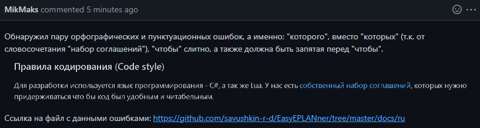
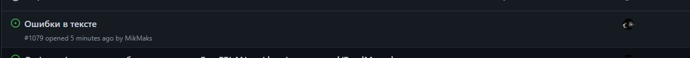

**_<h1 align = "center">Лабораторная работа №4</a>_**
**_<h1 align = "center">Работа с проектами</a>_**

Выполнил: 
Студент 3 курса  группы АС-59 
Савиков М.С. 
Проверил: 
Иванюк Д.С.

Брест 2022

## 
**Цель работы**

Внести свой вклад в проект (в виде оформления вопросов (issues)).

## **
Ход работы
**

Изучил представленные документы. Нашёл пару орфографических и пунктуационных ошибок в файле репозитория EPLAN Electric P8 - EPLANner:

  

## 
**Вопрос (issue)**

  

## **Вывод**

Оформил свой первый вопрос (issue).
