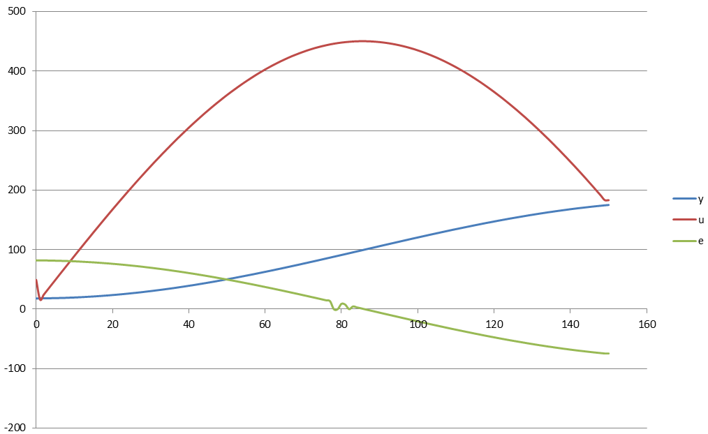
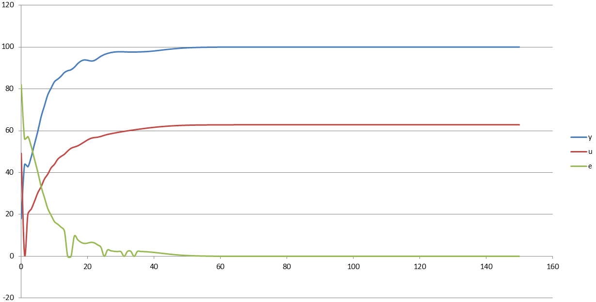

Министерство образования Республики Беларусь
Учреждение образования Брестский Государственный Технический Университет
Кафедра ИИТ
   
## Лабораторная работа №2
## "Математические модели информационных процессов и управления"
### "ПИД-регуляторы"
   
Выполнил: 
Студент 3 курса 
Группы АС-59 
Фоминюк Н.С.

Проверил: 
Иванюк Д.С.
   
Брест 2022
   
### Цель работы: контроль температуры объекта
## Ход работы 
## Результат выполнения программы
#### Линейная модель

#### Нелинейная модель

   
Полученные данные хранятся в папке files (внутри папки doc).