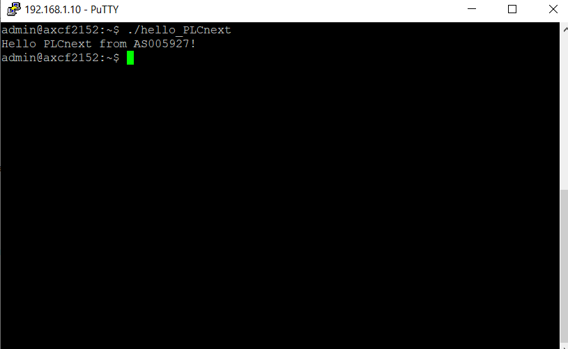

**_<h1 align = "center">Лабораторная работа №3</a>_**
**_<h1 align = "center">Запуск проекта на контроллере AXC F 215</a>_**

Выполнил: 
Студент группы АС-59 
Фоминюк Н.С. 
Проверил: 
Иванюк Д.С.

Брест 2022

## **Цель работы**

Собрать проект и запустить его на контроллере AXC F 215.

## **
Ход работы
**

Перед началом выполнения работы нам необходимо склонировать указанный репозиторий, установить следующие программы: PuTTy, WinSCP. А также, нам нужно установить необходимые для сборки проекта "main.cpp" расширения для Microsoft Visual Code. Также не забываем дописать в этот проект свои группу и номер. 
Далее собираем "main.cpp" и приступаем к выполнению данной работы.  
1) Подключаем своё устройство к контроллеру.  
2) Находим среди видимых сетей Ethernet. Необходимо задать IP-адрес 192.168.1.1 и маску 255.255.255.0. Далее, с помощью команды ping в консоли проверяем успешность подключения.  
3) Далее устанавливаем подключение к контроллеру через программу PuTTY. Логин: admin, пароль: 837b523f.  
4) Запустив программу WinSCP, указываем все необходимые выше описанные данные (IP контроллера, имя пользователя, пароль). После чего необходимо перебросить собранный нами проект с нашего устройства в контроллер.  
5) Осталось дать нашему файлу все права доступа (0777). После чего необходимо запустить этот файл, используя терминал контроллера.  

## 
**Итог работы**

## **Вывод**

Получил опыт работы с контроллером.