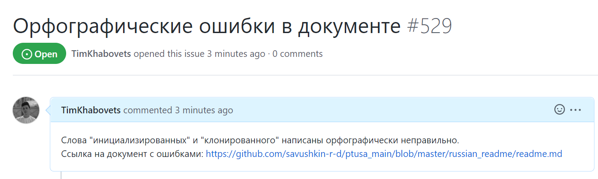

<h1 align = "center">Лабораторная работа №4  "Работа с проектами" </h1>

Выполнил: Хабовец Т.В.   
Проверил: Иванюк Д.С. 

 

## Цель работы:  
Изучить предложенные проекты и внести свой вклад в проект (в виде оформления вопросов (issues)). А именно провести следующие манипуляции:
  
 1. предложить исправления в ошибках в документации (синтаксические, орфографические и т.п.);
 2. предложить исправления в исходном коде;
 3. предложить новую функциональность.

## Ход работы  
В ходе изучения предложенных проектов, в документации одного из них были найдены орфографические ошибки. Создал issue, в котором указал на найденные мной недостатки. 

