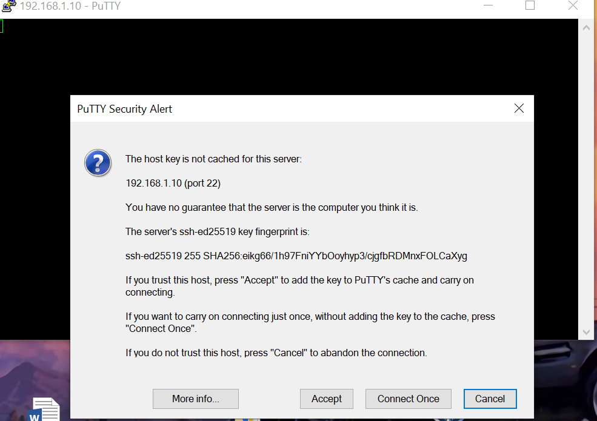

<h1 align = "center">Лабораторная работа №3 <br>"Работа с контроллером AXCF 2152"  </h1> 

<br> <br> <br> <br> 

<p align = "right">
Выполнил: Савиков М.С. <br>  
Проверил: Иванюк Д.С.  
</p>

<br> <br> <br> <br> 

## Цель работы:  

Создать тестовый проект "Hello PLCnext from AS005928!" и продемонстрировать его работу на контроллере. 

## Ход работы  
- склонировал репозиторий: https://github.com/savushkin-r-d/PLCnext-howto/tree/master/ 
- скачал программы: WinSCP и PuTTy  
- В main.cpp написал:  

```с++
cout << "Hello PLCnext from AS005928!" << endl;
```  
-  Для сборки проекта использовал VSCode и расширения: CMake, CMake Tools, MinGW.   
- В центре управления сетями и общим доступом, в сеть Ethernet написал ip: 192.168.1.1 и маску подсети: 255.255.255.0  
- Прописал "ping 192.168.1.10" в терминале для установки соединения.     
- Вводим в PuTTy ip: 192.168.1.10, такой же В WinSCP. В WinSCP ввёл имя пользователя (admin), и пароль с контроллера.  

Cкриншоты результатов выполнения работы:

   
  


## Вывод
Ознакомился и поработал с контроллером AXCF 215. Так же запустил на нем программу "Hello PLCnext".